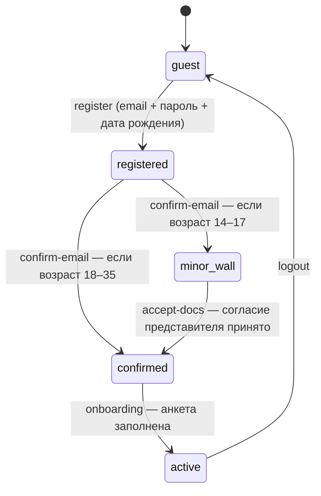

# Творцы РФ 2026 — Личный кабинет. Логика для передачи в разработку

> Документ описывает **всю бизнес-логику и флоу** прототипа ЛК так, чтобы по нему могли работать
> два человека: **верстальщик** (доводит вёрстку/экраны) и **бэкенд-разработчик** (реализует
> серверные функции и интегрирует со своим фронтом).
>
> Прототип — это React + Vite **без сервера**: вся логика крутится на клиенте и сохраняется в
> `localStorage`. Здесь зафиксированы правила, состояния и переходы — чтобы бэк понимал, *что
> должен делать сервер*, а верстальщик — *какие состояния экрана нужно нарисовать*.
>
> Все строковые ключи действий (`'register'`, `'submit-app'` …), названия полей и статусов даны
> **дословно** — это контракт, на который завязан текущий код.

---

## Содержание

1. [Как читать этот документ](#1-как-читать-этот-документ)
2. [Что это и на чём сделано](#2-что-это-и-на-чём-сделано)
3. [Глоссарий доменных понятий](#3-глоссарий-доменных-понятий)
4. [Стадии аккаунта (главный автомат состояний)](#4-стадии-аккаунта-главный-автомат-состояний)
5. [Роутинг и доступ к экранам](#5-роутинг-и-доступ-к-экранам)
6. [Сквозные сценарии (флоу)](#6-сквозные-сценарии-флоу)
7. [Экраны по одному](#7-экраны-по-одному)
8. [Модель данных](#8-модель-данных)
9. [Бизнес-правила](#9-бизнес-правила)
10. [Валидация полей](#10-валидация-полей)
11. [Что сейчас замокано и что нужно от бэкенда](#11-что-сейчас-замокано-и-что-нужно-от-бэкенда)
12. [Дизайн-токены и стили (для верстальщика)](#12-дизайн-токены-и-стили-для-верстальщика)
13. [Открытые вопросы и что стоит уточнить у заказчика](#13-открытые-вопросы-и-что-стоит-уточнить-у-заказчика)

---

## 1. Как читать этот документ

**Бэкенд-разработчику** важны разделы: [4 (автомат)](#4-стадии-аккаунта-главный-автомат-состояний),
[8 (модель данных)](#8-модель-данных), [9 (бизнес-правила)](#9-бизнес-правила),
[10 (валидация)](#10-валидация-полей), [11 (API-контракт)](#11-что-сейчас-замокано-и-что-нужно-от-бэкенда).
Там — какие сущности, какие правила и где их **обязательно проверять на сервере**.

**Верстальщику** важны разделы: [5 (роутинг)](#5-роутинг-и-доступ-к-экранам),
[6 (флоу)](#6-сквозные-сценарии-флоу), [7 (экраны)](#7-экраны-по-одному),
[12 (токены/стили)](#12-дизайн-токены-и-стили-для-верстальщика).
Там — какие у экрана состояния, что показывать в каждом, какими токенами оформлять.

Слово **«действие»** (action) в тексте — это событие в текущем клиентском сторе. Для бэка это
ориентир: *что* должно происходить и *с какими данными*. Маппинг действий на возможные эндпоинты —
в [разделе 11](#11-что-сейчас-замокано-и-что-нужно-от-бэкенда).

---

## 2. Что это и на чём сделано

**`tvortsy-lk`** — личный кабинет участника фестиваля «Творцы РФ 2026». Участник регистрируется,
заполняет анкету, подаёт заявку в одну из 5 номинаций (соло или командой), грузит материалы и
следит за статусом рассмотрения.

**Стек прототипа:**

| | |
|---|---|
| Фреймворк | React 18 + Vite 5 |
| Роутинг | `react-router-dom` v6, **HashRouter** (URL вида `/#/cabinet`) |
| Состояние | один глобальный стор: `useReducer` + Context (`src/state/store.jsx`) |
| Хранение | `localStorage`, ключ `tvortsy-lk-state-v2` (нет бэкенда) |
| Стили | чистый CSS + CSS-переменные (`src/styles/*.css`), без фреймворка |
| Язык | весь UI, комментарии и коммиты — **на русском** |

> ⚠️ В проде у «боевого близнеца» (`applications.tvortsy.online`) — **BrowserRouter (чистые пути)** и
> реальный `/api`. Если интегрируете в боевой фронт, учитывайте, что хеш-роутинг здесь — частность
> прототипа.

Запуск: `npm install` → `npm run dev`. В DEV-режиме внизу справа есть кнопка **demo** — через неё
открывается любое состояние (см. [раздел 7.6](#76-demopanel-инструмент-демонстрации)).

---

## 3. Глоссарий доменных понятий

| Термин | Значение |
|---|---|
| **Стадия (stage)** | Состояние аккаунта: `guest → registered → confirmed → active` (+ ветка `minor-wall`). Главный автомат, на нём завязан весь доступ. |
| **Номинация** | Направление конкурса: `audio` / `media` / `dance` / `visual` / `synth`. У каждой свои допустимые форматы файлов и лимит размера. |
| **Синтез (`synth`)** | Особая номинация «на стыке направлений»: требует **≥2 направлений**, грант ×2, суммарный лимит файлов 800 МБ. |
| **Заявка (application)** | Работа участника. Имеет статус, номинацию, материалы, состав команды, согласия. |
| **Черновик (draft)** | Заявка в статусе `draft`. Не считается «поданной», в лимит не входит. |
| **Цикл (CYCLE)** | Видимый таймлайн статусов поданной заявки: `submitted → review → admitted → results`. |
| **Доработка (rework)** | Боковой статус: заявку вернули, участник её «исправляет» (переводит обратно в черновик). |
| **Команда / приглашение** | У заявки `mode: 'team'` есть состав `members`. Приглашённый известен только по email, пока не примет приглашение. |
| **Капитан (captain)** | Владелец командной заявки. Заводит команду, приглашает, не может быть удалён. |
| **Стена согласий (minor-wall)** | Экран для участников **14–17 лет**: до кабинета нужно согласие законного представителя. |
| **Стадии файла** | Жизненный цикл загружаемого материала: `queue → progress → done`, плюс ошибочные `broken` / `over` / `error`. |

---

## 4. Стадии аккаунта (главный автомат состояний)

Весь доступ к приложению гейтится полем `state.stage`.



| Стадия | Что значит | Куда ведёт «домой» (`/`) |
|---|---|---|
| `guest` | Не авторизован | `/login` |
| `registered` | Ввёл email + пароль + дату рождения, **ждёт код подтверждения** | `/confirm` |
| `confirmed` | Email подтверждён, **нужно заполнить анкету** | `/onboarding` |
| `minor-wall` | 14–17 лет: **нужно согласие представителя** | `/wall` |
| `active` | Полноценный участник | `/cabinet` |

**Ключевые правила автомата:**

- **Возраст спрашивается на регистрации, а не в анкете.** Причина: до 18 лет нельзя
  зарегистрироваться без согласия, поэтому дату рождения собираем первой. Возраст определяет путь
  сразу после подтверждения почты.
- Решение по возрасту — функция `dobVerdict(dob)`:
  - `< 14` → **young** (блок: «Участвовать можно с 14 лет»)
  - `> 35` → **old** (блок: «Участвовать можно до 35 лет включительно»)
  - `14–17` → **minor** (после подтверждения почты идёт на `minor-wall`)
  - `18–35` → **ok**
- **Вход (`login`) не перепрыгивает незавершённые шаги.** Если пользователь был на `registered` /
  `confirmed` / `minor-wall`, после входа он возвращается туда же, а не в кабинет.
- **`pendingInvite`** — если человек пришёл по ссылке-приглашению `/join/:id` будучи гостем, id
  заявки запоминается и переживает регистрацию/вход. После анкеты его ведёт не в кабинет, а обратно
  на экран приглашения.

---

## 5. Роутинг и доступ к экранам

Все маршруты объявлены в `src/App.jsx`. Роутер — **HashRouter**.

| Маршрут | Экран | Доступ |
|---|---|---|
| `/` | Index — редирект | По стадии → её «домашний» маршрут (таблица выше) |
| `/register` | Регистрация (шаг 1) | Публично |
| `/confirm` | Подтверждение email | Публично (но осмысленно для `registered`) |
| `/onboarding` | Анкета участника (шаг 2) | Публично (осмысленно для `confirmed`) |
| `/wall` | Стена согласий 14–17 | Публично (осмысленно для `minor-wall`) |
| `/login` | Вход | Публично |
| `/recovery` | Восстановление пароля | Публично |
| `/join/:id` | Приглашение в команду | **Публично** — авторизация происходит внутри экрана |
| `/cabinet` | Кабинет | Только `active` (иначе редирект на «домой» по стадии) |
| `/profile` | Профиль | Только `active` |
| `/apply/:id` | Форма заявки | Только `active` + заявка должна быть `draft` (иначе → `/cabinet`) |
| `/success/:id` | Экран «Заявка подана» | Только `active` (заявки нет → `/cabinet`) |
| `*` | Любой неизвестный | Редирект как `/` |

Гард `RequireActive` оборачивает `/cabinet`, `/profile`, `/apply/:id`, `/success/:id`: если стадия
не `active` — выкидывает на «домашний» маршрут текущей стадии.

---

## 6. Сквозные сценарии (флоу)

### 6.1. Регистрация → активный участник (взрослый, 18–35)

```
/register  ──register──▶  /confirm  ──confirm-email──▶  /onboarding  ──onboarding──▶  /cabinet
 email+пароль+ДР          код (4 цифры)                 анкета участника
```

1. **`/register`**: вводит email, пароль (≥8, буква+цифра), дату рождения, ставит галочку согласия
   на обработку ПДн. Действие `register` → стадия `registered`.
2. **`/confirm`**: вводит 4-значный код (в прототипе — **любые 4 цифры**). Действие `confirm-email`
   → стадия `confirmed`. Есть таймер повторной отправки (60 с).
3. **`/onboarding`**: заполняет ФИО, телефон, национальность, город, место работы/учёбы. Действие
   `onboarding` → стадия `active`. → редирект в `/cabinet` (или в `/join/:id`, если был
   `pendingInvite`).

### 6.2. Регистрация несовершеннолетнего (14–17)

```
/register  ──▶  /confirm  ──confirm-email──▶  /wall  ──(модератор: accept-docs)──▶  /onboarding  ──▶  /cabinet
 (возраст 14–17 распознан)                    стена согласий, ждёт проверки документов
```

- На `/register` под датой рождения показывается баннер: «Понадобится согласие родителя».
- После подтверждения почты — не в анкету, а на **`/wall`**: участник сам загружает согласие
  представителя в своём кабинете-ожидании; статус документов `none → review → ok` (или `replace`,
  если модератор вернул на замену).
- Когда модератор принимает документы (действие `accept-docs`) → стадия `confirmed` → участник
  дозаполняет анкету → `active`.

> ⚠️ В текущем прототипе сама загрузка документа и решение модератора имитируются через demo-панель.
> На `/wall` показаны контакты фонда (`lk@tvortsy.online`, Telegram `@tvortsy_lk`).

### 6.3. Вход

```
/login  ──login──▶  по стадии:
                     registered → /confirm
                     confirmed  → /onboarding
                     minor-wall → /wall
                     есть pendingInvite → /join/:id
                     иначе      → /cabinet
```

- **Демо-логика:** принимается email `m.sokolova@mail.ru` (или совпадающий с `state.email`) + **любой
  непустой пароль**. Иначе — ошибка «Не удалось войти…».

### 6.4. Восстановление пароля (3 шага, целиком на экране `/recovery`)

```
шаг 1: email  ──▶  шаг 2: «проверь почту» (таймер 60 с, ссылка живёт 24 ч)  ──▶  шаг 3: новый пароль  ──▶  /login
```

В прототипе письмо не отправляется; переход между шагами — по демо-кнопке/таймеру. Стор не трогается.

### 6.5. Приглашение в команду

```
Капитан в форме заявки ──add-member(email)──▶ участник получает ссылку /join/:id
                                              │
   гость? → set-pending-invite → /login|/register → после анкеты возврат на /join/:id
   active? → видит приглашение, Принять/Отклонить
                                              │
   Принять  → respond-invite(tag:'confirmed') → имя подтягивается из профиля → /cabinet
   Отклонить→ respond-invite(tag:'declined')
   14–17 и не прошёл стену → сначала /wall
```

- Пока приглашённый не принял — в составе у него **только email, имя пустое**.
- На приглашение можно ответить и в кабинете (карточка/баннер приглашения), и на экране `/join/:id`.
- Фиксированный демо-id команды — `team-shum`, чтобы ссылка `/join/team-shum` работала из коробки.

> ⚠️ Известное ограничение прототипа: у свежезарегистрированного гостя по ссылке нет самой команды в
> сторе (она появляется только в demo-сценариях `invitee` / `invitee-minor`). На бэке это решается
> тем, что заявка-команда реально существует на сервере и подтягивается по `:id`.

---

## 7. Экраны по одному

Для каждого экрана: что собирает, какие действия шлёт (дословные ключи), куда уходит, какие
состояния надо отрисовать.

### 7.1. Авторизационные экраны

Все используют общий макет **`AuthSplit`**: слева тёмный «постер-питч» (`#15151A`), справа светлая
панель с формой.

#### `/register` — Регистрация, шаг 1
- **Поля:** Email (`vEmail`), Пароль (`vPassword`), Дата рождения (`vDob`, маска `ДД.ММ.ГГГГ`),
  чекбокс согласия на обработку ПДн (обязателен).
- **Действие:** `register { email, dob }` (при всех валидных полях и поставленной галочке) → `/confirm`.
- **Состояния:** баннер «Понадобится согласие родителя» при возрасте 14–17; ошибка, если не отмечено
  согласие; кнопка соц-входа показывает заглушку-тост «Демо: быстрый вход недоступен».
- **Навигация:** «Войти» → `/login`.

#### `/confirm` — Подтверждение email
- **Поля:** 4 ячейки кода (только цифры; авто-переход фокуса, Backspace на пустой ячейке — назад).
- **Действия:** `confirm-email` (когда введены все 4 цифры) → `/onboarding` (или `/wall`, если
  возраст 14–17); `change-email` → `/register`; `logout` → `/login`.
- **Состояния:** кнопка «Подтвердить» неактивна, пока не введены 4 цифры; таймер повторной отправки
  60 с, по нулю — кнопка «Отправить код ещё раз» (сброс на 60); показывается адрес `state.email`.
- **Правило:** код — **любые 4 цифры** (значение не проверяется).

#### `/onboarding` — Анкета участника, шаг 2
- **Поля:** Фамилия (`vName`), Имя (`vName`), Отчество (`vNameOpt`, необяз.), Телефон (`vPhone`,
  маска `+7 …`), Национальность (`vRequired`), Город (`vRequired`), Место работы/учёбы (необяз.).
- **Действие:** `onboarding { profile }` → стадия `active` → `/cabinet` (или `/join/:id`, если есть
  `pendingInvite`).
- Возраст здесь **не** спрашивается (он с регистрации).

#### `/wall` — Стена согласий (14–17)
- **Нет формы.** Информационный экран ожидания: контакты фонда, режим работы «Будни 10:00–19:00 (МСК)».
- **Действие:** `logout` → `/login`.
- **Состояния-редиректы:** если стадия уже `confirmed` → `/onboarding`; если `active` → `/cabinet`
  (или `/join/:id`).

#### `/login` — Вход
- **Поля:** Email (`vEmail`), Пароль (без жёсткой валидации — принимается любой непустой).
- **Действие:** `login { email }` → маршрут по стадии/`pendingInvite` (см. [6.3](#63-вход)).
- **Состояния:** общая ошибка входа на обоих полях; соц-вход — заглушка-тост.
- **Навигация:** «Зарегистрироваться» → `/register`; «Забыли пароль?» → `/recovery`.

#### `/recovery` — Восстановление пароля
- **Шаги:** 1) email (`vEmail`) → 2) «проверь почту» + таймер 60 с + демо-ссылка «открыть письмо» →
  3) новый пароль (`vPassword`) + повтор (`vMatch`).
- **Действий в сторе нет** (флоу до входа). По завершении → `/login`.

### 7.2. `/cabinet` — Кабинет

Главный экран активного участника. Read-only витрина + модалки подтверждения.

**Что показывает (ветвление):**
- **Пустой кабинет** (нет заявок): карточка-подсказка + кнопка «Подать заявку».
- **Приглашения** (где ты `invited`): баннер и/или карточка с именем капитана и кнопками
  «Принять» / «Отклонить» + ссылка «о приглашении» → `/join/:id`.
- **Черновики**: компактная карточка на каждый, прогресс «заполнено N из 4 разделов».
- **Командные заявки, где ты не капитан** (`confirmed`): read-only карточка — название команды,
  капитан, номинация, состав (без email — приватность), файлы, таймлайн статуса, кнопка «Покинуть
  команду».
- **Поданные заявки**: пронумерованы 01/02, с таймлайном статуса; если статус `rework` — красный
  блок с `reworkNote` и кнопка «Исправить»; боковая подсказка по статусу.
- **Лимит:** если поданных ≥ 2 — вместо «+ Подать заявку» показывается баннер «Все места заняты ·
  2 из 2» с подсказкой отозвать одну.

**Действия:**

| Кнопка/событие | Действие | Затем |
|---|---|---|
| «+ Подать заявку» | `create-draft { draft }` | → `/apply/:id` |
| «Принять» (приглашение) | `respond-invite { id, tag: 'confirmed' }` | — |
| «Отклонить» (приглашение) | `respond-invite { id, tag: 'declined' }` | — |
| Подтверждение «Отозвать заявку?» | `withdraw-app { id }` | — |
| Подтверждение «Удалить черновик?» | `withdraw-app { id }` | — |
| Подтверждение «Покинуть команду?» | `leave-team { id }` | — |
| «Исправить» (на доработке) | `reopen-app { id }` (→ статус `draft`) | → `/apply/:id` |
| Открыть черновик | — | → `/apply/:id` |

### 7.3. `/profile` — Профиль

**Левая колонка** — карточка профиля: аватар (инициалы), ФИО, город + email. Поля редактируются
инлайн (компонент `PRow`): клик «Редактировать»/«Добавить» → инпут → «Сохранить»/«Отмена» (Enter
сохраняет, Esc отменяет).

**Поля и доступность редактирования:**

| Поле | Валидатор | Маска | Редактируется |
|---|---|---|---|
| Фамилия | `vName` | — | да |
| Имя | `vName` | — | да |
| Отчество | `vNameOpt` | — | да |
| Телефон | `vPhone` | `maskPhone` | да |
| Место работы/учёбы | — | — | да |
| Дата рождения | — | — | нет (read-only) |
| Национальность | `vRequired` | — | нет (read-only) |
| Город | `vRequired` | — | нет (read-only) |

**Правая колонка** — две карточки:
- **«Вход в аккаунт»**: email (read-only), кнопка «Сменить пароль» (модалка: старый/новый/повтор;
  правило нового — `vPassword`), ссылка «Выйти из аккаунта» → `/login`.
- **«Быстрые входы»**: тумблеры VK ID и Яндекс ID.

**Действия:** `profile-patch { patch: { [поле]: значение } }` (сохранение поля); `social-toggle
{ key: 'vk' | 'yandex' }`.

> ⚠️ В прототипе «Сменить пароль» закрывает модалку и показывает тост, но **не шлёт действие в стор**
> — на бэке это должен быть реальный запрос смены пароля.

### 7.4. `/apply/:id` — Форма заявки

Доступна **только для заявки в статусе `draft`** (иначе редирект в `/cabinet`). Авто-сохранение: любое
изменение шлёт `patch-app` с обновлением `updatedAt`. 4 раздела с якорями `s01…s04` и скролл-навигацией.

**Раздел 01 — Номинация (`s01`)**
- 4 карточки (`audio`, `visual`, `dance`, `media`) + карточка «Синтез» с под-чипами направлений.
- Выбор: `patch-app { patch: { nomination, synthDirs: [] } }` (смена номинации **сбрасывает**
  `synthDirs`).
- Для `synth`: выбрать **≥2 направления** из `audio/media/dance/visual` (мульти-чипы). Меньше двух —
  раздел считается незаполненным.
- Номинация, уже занятая ранее **поданной** заявкой участника, должна быть **недоступна** для выбора
  (одна заявка на номинацию — см. [раздел 9, правило 3](#9-бизнес-правила)).

**Раздел 02 — Работа (`s02`)**
- **Название** (`title`), **Описание** (`description`, до 1000 знаков).
- **Файлы:** добавление через пикер/drag-drop. На добавление вызывается `classifyFile(name, sizeMB,
  nomination, files)` → стартовое состояние файла. Действия: `add-file`, `remove-file`, `patch-file`
  (докачать).
- **Ссылка на облако** (`link`) — поле появляется, **только если какой-то файл получил состояние
  `over`** (больше лимита).
- **Замена файла:** «заменить» → `remove-file` старого + добавление нового.

**Раздел 03 — Команда (`s03`)**
- Переключатель **Соло / Команда**. При переходе в команду шлётся `ensure-captain` (текущий
  пользователь становится капитаном).
- **Соло:** показываются данные из профиля (read-only участник-бар).
- **Команда:** название команды (`teamName`), список участников, приглашение по email
  (`add-member { member: { email, tag: 'invited', name: '' } }` после `vEmail`), копирование
  ссылки-приглашения, удаление участника (`remove-member`, капитана нельзя), «Напомнить».
- Теги участников: `in` (капитан-ты) / `confirmed` (принял) / `invited` (ждёт ответа) / `declined`
  (отклонил).

**Раздел 04 — Согласия и подача (`s04`)**
- 2 чекбокса: «С правилами фестиваля согласен» (`consents[0]`) и «Предоставляю неисключительную
  лицензию» (`consents[1]`). (Согласие на ПДн — отдельно, на регистрации.)
- **Подача:** `submit-app { id }` активна только когда `computeTodos(app)` пуст **и** не достигнут
  лимит. После — `nav('/success/:id')`.

**Что проверяет `computeTodos` (список «Осталось: …», блокирует подачу):**
выбрана номинация; для синтеза — ≥2 направления; есть название; есть описание; нет файла в загрузке;
нет «битого» файла; если файл `over` — указана ссылка; есть хотя бы один готовый файл (или `over` +
ссылка); нет файлов, не подходящих под номинацию; для команды — есть название и хотя бы один не-капитан;
нет приглашений без ответа; отмечены оба согласия.

### 7.5. `/success/:id` — Заявка подана
- Иконка успеха, строка «Заявка №… · номинация · дата/время», таймлайн (статус `submitted`),
  подсказка «можно ещё отредактировать/отозвать, пока статус Подана».
- Кнопки: «К моим заявкам» → `/cabinet`; «Подать ещё одну» → `create-draft` → `/apply/:id` (неактивна,
  если достигнут лимит).
- Гард: если заявки по `:id` нет — редирект в `/cabinet`.

### 7.6. DemoPanel (инструмент демонстрации)

DEV-only кнопка **demo** внизу справа. **На прод не идёт** (монтируется только при `import.meta.env.DEV`).
Это эталон «всех достижимых состояний» — удобно как чек-лист для приёмки.

**Сценарии (`scenario { name }`):** `fresh` (новый пользователь), `maria-empty` (пустой кабинет),
`maria-full` (черновик + 2 заявки), `maria-team` (командная заявка), `invitee` (Кирилл 18+,
приглашён), `invitee-minor` (Тимур 14–17, приглашён), `minor` (Тимур на стене согласий).

**Действия модератора:** `accept-docs` (принять документы минора), `replace-minor-doc { doc }`
(вернуть документ на замену), `advance-status { id }` (продвинуть по циклу), `rework-app { id }`
(вернуть на доработку), `patch-file { … state }` (имитировать/оборвать загрузку),
`member-tag { id, memberId, tag }` (подтвердить приглашённого).

> 💡 Для бэка `accept-docs`, `advance-status`, `rework-app`, `member-tag` — это **действия
> модератора/администратора**, которым в проде нужна отдельная панель и права.

---

## 8. Модель данных

Источник истины — `src/state/store.jsx`. Ниже — формы объектов как есть в прототипе. Бэк может
переименовать поля, но семантику важно сохранить.

### 8.1. Корень состояния

```js
{
  stage: 'guest',                 // guest | registered | confirmed | minor-wall | active
  email: '',
  profile: { … },                 // см. 8.2
  minorDocs: {                    // документы несовершеннолетнего
    participation: 'none',        // none | review | ok | replace
    pdn: 'none',                  // none | review | ok | replace
  },
  minorDocNames: { … },           // имена загруженных файлов согласий (опц.)
  socials: { vk: true, yandex: false },
  apps: [ … ],                    // массив заявок, см. 8.3
  appSeq: 849,                    // счётчик следующего номера ТВ-2026-XXXX
  pendingInvite: null,            // id заявки-приглашения, ожидающего ответа после авторизации
}
```

### 8.2. Профиль участника

```js
{
  lastName: '',     // Фамилия
  firstName: '',    // Имя
  middleName: '',   // Отчество (необязательно)
  dob: '',          // дата рождения, строка «ДД.ММ.ГГГГ»
  phone: '',        // «+7 917 240-18-66»
  nationality: '',  // национальность (не «гражданство» — правка заказчика)
  city: '',
  work: '',         // место работы/учёбы (необязательно)
}
```

- **Полное имя** — порядок «Фамилия Имя Отчество».
- **Инициалы** — наоборот, **Имя+Фамилия**: «Соколова Мария» → «МС». (Важная договорённость, не
  перепутать порядок.)

### 8.3. Заявка

```js
{
  id: 'id…',                 // уникальный id
  num: 'ТВ-2026-0848',       // человекочитаемый номер
  status: 'draft',           // draft | submitted | review | rework | admitted | results
  nomination: null,          // null | audio | media | dance | visual | synth
  synthDirs: [],             // для synth: ≥2 из [audio, media, dance, visual]
  title: '',
  description: '',
  mode: 'solo',              // solo | team
  teamName: '',
  members: [ … ],            // см. 8.4
  files: [ … ],              // см. 8.5
  link: '',                  // ссылка на облако при превышении лимита размера
  consents: [false, false],  // [Положение фестиваля, лицензия]; ПДн — на регистрации
  reworkNote: '',            // текст замечания при возврате на доработку
  submittedAt: null,         // дата подачи «дд.мм.гггг»
  submittedTime: undefined,  // время подачи «чч:мм»
  updatedAt: '12:40',        // время последнего изменения
}
```

**Статусы и их отображение:**

| status | Подпись | Цвет/класс | В цикле? |
|---|---|---|---|
| `draft` | Черновик | нейтральный (`wait`) | нет (вне цикла) |
| `submitted` | Подана | обычный | да |
| `review` | На проверке | `wait` | да |
| `rework` | На доработку | ошибка (`err`) | боковой |
| `admitted` | Допущена | успех (`ok`) | да |
| `results` | Итоги | успех (`ok`) | да |

Видимый цикл таймлайна: `submitted → review → admitted → results`. Ориентировочные даты этапов
(`CYCLE_DATES`): submitted/review — июнь, admitted — июль–сентябрь, results — ноябрь.

### 8.4. Участник команды

```js
{
  id: 'id…',
  name: '',                  // пусто, пока приглашённый не принял (известен только email)
  email: 'k.dmitriev@inbox.ru',
  role: 'member',            // captain | member
  tag: 'invited',            // in | confirmed | invited | declined
}
```

- `in` — капитан/ты «в команде»; `confirmed` — приглашённый принял; `invited` — ждёт ответа;
  `declined` — отклонил.
- При принятии приглашения имя подтягивается из профиля принявшего.

### 8.5. Файл материала

```js
{
  id: 'id…',
  name: 'rabota_final.wav',
  sizeMB: 412,
  state: 'done',             // queue | progress | broken | done | error | over
  pct: 100,                  // прогресс загрузки 0–100
  errText: '',               // текст ошибки (для error/over/broken)
  note: '',                  // подсказка (например «в очереди»)
}
```

**Состояния файла:**

| state | Значение |
|---|---|
| `queue` | В очереди, загрузка начнётся автоматически (очередь последовательная: грузится один файл) |
| `progress` | Загружается (растёт `pct`) |
| `done` | Загружен успешно |
| `over` | Превышает лимит размера → требуется ссылка на облако |
| `error` | Неверный формат под номинацию |
| `broken` | Загрузка оборвалась — нужно докачать |

### 8.6. Справочник номинаций

| Ключ | Название | Форматы | Лимит | Особое |
|---|---|---|---|---|
| `audio` | Аудио | MP3, WAV | 300 МБ | 1–2 трека |
| `visual` | Визуал | PDF, PNG | 100 МБ | до 12 работ |
| `dance` | Танец | MP4 | 500 МБ | видео 3–5 мин |
| `media` | Медиа | MP4 | 500 МБ | 1 фильм до 15 мин |
| `synth` | Синтез | любые из MP3/WAV/MP4/PDF/PNG | **800 МБ суммарно** | ≥2 направления, грант ×2 |

---

## 9. Бизнес-правила

Правила, помеченные 🔒, **обязательно дублировать на сервере** — клиент им не защита.

1. 🔒 **Возрастной ценз 14–35.** До 14 и старше 35 — регистрация блокируется. 14–17 — только через
   согласие представителя (стена `minor-wall`).
2. 🔒 **Лимит поданных заявок — 2** (`APP_LIMIT`). Черновики не считаются. Проверяется при подаче
   (`submit-app`): если поданных уже ≥2 — подача не проходит. На клиенте кнопка блокируется и
   показывается баннер «Все места заняты · 2 из 2».
3. 🔒 **Одна заявка на номинацию.** Нельзя подать **две заявки в одну и ту же номинацию** (включая
   «Синтез»). Среди *поданных* заявок номинации не повторяются. UX: в форме при выборе номинации те,
   что уже заняты поданной заявкой участника, должны быть недоступны; на сервере — проверка при
   `submit`. Черновики можно держать любые, но второй `submit` в занятую номинацию не проходит.
   Вместе с лимитом 2 это значит: максимум 2 заявки — обе в разных номинациях.
4. 🔒 **Полнота заявки перед подачей** — все пункты `computeTodos` закрыты (см. [7.4](#74-applyid--форма-заявки)).
5. 🔒 **Валидация файла под номинацию** (`classifyFile`):
   - формат не из списка номинации → `error` («Формат … не подходит — загрузи …»);
   - размер больше лимита → `over` (для обычных номинаций — на файл; для `synth` — **суммарно по
     всем файлам** заявки) → требуется ссылка на облако.
6. **Синтез** требует ≥2 направлений и допускает любые форматы из общего набора; лимит 800 МБ —
   суммарный.
7. **Смена номинации** сбрасывает `synthDirs` и может сделать ранее загруженные файлы «не
   подходящими» (`misfitFiles`) — тогда раздел просит заменить файлы.
8. **Очередь загрузки последовательная** — одновременно грузится один файл, остальные в `queue`.
9. **Согласия:** 2 чекбокса в форме (Положение + лицензия) обязательны для подачи; согласие на ПДн —
   на регистрации.
10. **Команда:** приглашённый известен только по email до принятия; имя приходит из его профиля при
    `confirmed`. Капитана нельзя удалить. Приглашения **бессрочные** (правка заказчика — без дат).
11. **Доработка (`rework`)**: участник жмёт «Исправить» → заявка снова `draft` (`reopen-app`),
    лимит при этом не трогается (она и так была подана). После правок — снова `submit-app`.
12. **Отзыв/удаление:** `withdraw-app` удаляет заявку из списка (и для поданной, и для черновика).
    Отозвав заявку, участник освобождает её номинацию — в неё снова можно подать.
13. **Автосохранение** черновика — при каждом изменении (в прототипе debounce 400 мс к localStorage).

---

## 10. Валидация полей

Слой `src/state/validation.js`. Валидатор возвращает `null | {error} | {warn} | {warn, block}`:
`error` — жёсткая ошибка (красный, блокирует); `warn` — мягкое предупреждение (янтарный, по
умолчанию **не** блокирует); `warn + block` — предупреждение, которое всё же блокирует.

| Валидатор | Правило | Сообщения (примеры) |
|---|---|---|
| `vEmail` | непусто, есть `@`, без пробелов, формат `x@y.z` | «Укажи почту», «В адресе не хватает “@”» |
| `vPhone` | 11 цифр, начинается с 7 или 8 | «В номере не хватает цифр», «Начни с +7 или 8» |
| `vName(msg)` | непусто; только буквы (рус/лат), дефис, апостроф; одно слово | «Только буквы — без цифр», «Одно слово — без пробелов» |
| `vNameOpt` | как `vName`, но пусто — допустимо (для отчества) | — |
| `vDob` | формат `ДД.ММ.ГГГГ`; **<14 и >35 — блокирующее предупреждение** | «Формат: ДД.ММ.ГГГГ», «Участвовать можно с 14 лет» |
| `vPassword` | ≥8 символов, ≥1 буква, ≥1 цифра | «Добавь ещё N — пароль от 8 символов» |
| `vRequired(msg)` | непусто | «Заполни поле» |
| `vMinLen(n)` | не короче n | «Слишком коротко — нужно не меньше N символов» |
| `vMatch(other)` | совпадает с другим значением | «Пароли не совпадают» |

**Маски ввода:** `maskPhone` → `+7 917 240-18-66` (8 → 7, авто-код); `maskDob` → `ДД.ММ.ГГГГ`.
Разделители ставятся только перед следующей цифрой — Backspace работает естественно.

**Поведение поля (`useField` + `<Field>`):** ошибка/предупреждение показываются после `blur`
(`touched`) либо при `eager`; зелёная галочка успеха — «живо» по мере ввода; при сабмите
`revealInvalid()` раскрывает ошибки всех полей и фокусирует первое невалидное.

---

## 11. Что сейчас замокано и что нужно от бэкенда

Прототип всё делает на клиенте. Ниже — что подменено и какой серверный функционал за этим стоит.
**Эндпоинты — это предложение** (зеркало действий стора); адаптируйте под свой API.

### 11.1. Что сейчас имитируется

| Подсистема | Сейчас в прототипе | Нужно на сервере |
|---|---|---|
| Регистрация/вход | принимается демо-email + любой пароль | реальная аутентификация, хранение пароля (хэш), сессии/токены |
| Код подтверждения email | любые 4 цифры | генерация и проверка кода, отправка письма, срок жизни, повторная отправка |
| Восстановление пароля | флоу без бэка, письмо не уходит | письмо со ссылкой (TTL 24 ч), сброс пароля |
| Загрузка файлов | имитация прогресса по таймеру | реальная загрузка (в проде — presigned multipart), проверка формата/размера, антивирус |
| Лимит/полнота заявки | проверка на клиенте | 🔒 проверка при `submit` на сервере |
| Возрастной ценз | `dobVerdict` на клиенте | 🔒 проверка на сервере |
| Согласие несовершеннолетнего | статусы меняет demo-панель | приём файла согласия, модерация, статусы `review/ok/replace` |
| Действия модератора | demo-панель | админ-панель с правами (продвижение статусов, доработка, приём документов, подтверждение приглашённых) |
| Соц-входы (VK/Яндекс) | тосты-заглушки | реальный OAuth |
| Приглашения | в сторе клиента | заявка-команда на сервере, отправка письма-приглашения со ссылкой `/join/:id`, ответ приглашённого |

### 11.2. Предлагаемый маппинг действий → API

> Формат: `действие стора` → `HTTP метод путь` (что делает). 🔒 — правило проверять на сервере.

**Аутентификация и аккаунт**
- `register {email, password, dob}` → `POST /auth/register` — создать аккаунт, отправить код. 🔒 ценз 14–35.
- `confirm-email {code}` → `POST /auth/confirm` — проверить код; вернуть следующую стадию (для 14–17 → `minor-wall`, иначе `confirmed`).
- (повтор кода) → `POST /auth/resend-code`
- `change-email` → `PATCH /auth/email` (или повторная регистрация)
- `login {email, password}` → `POST /auth/login` — вернуть стадию + токен.
- `logout` → `POST /auth/logout`
- восстановление → `POST /auth/recovery/request {email}` и `POST /auth/recovery/reset {token, password}`

**Профиль**
- `onboarding {profile}` → `PUT /profile` (первичное заполнение, стадия → `active`)
- `profile-patch {patch}` → `PATCH /profile`
- смена пароля → `POST /profile/password`
- `social-toggle {key}` → `POST /profile/socials/:provider` (OAuth)

**Несовершеннолетний**
- `upload-minor-doc {doc, name}` → `POST /minor/docs/:doc` (статус → `review`)
- `accept-docs` / `replace-minor-doc` → действия модератора: `POST /admin/minor/:userId/accept` / `.../replace`

**Заявки**
- `create-draft` → `POST /applications` (создать черновик, вернуть `id` и `num`)
- `patch-app {id, patch}` → `PATCH /applications/:id` (автосохранение)
- `submit-app {id}` → `POST /applications/:id/submit` — 🔒 лимит 2 + уникальность номинации + полнота + ценз.
- `withdraw-app {id}` → `DELETE /applications/:id` (отзыв/удаление черновика)
- `reopen-app {id}` → `POST /applications/:id/reopen` (из `rework` в `draft`)
- модерация: `advance-status` / `rework-app` → `POST /admin/applications/:id/status`

**Файлы**
- `add-file` → инициировать загрузку (presigned URL); 🔒 `classifyFile` на сервере (формат/размер, для synth — суммарно).
- `patch-file` / `remove-file` → обновить/удалить материал.

**Команда / приглашения**
- `ensure-captain` → создаётся при переводе заявки в `team` (текущий пользователь — капитан).
- `add-member {email}` → `POST /applications/:id/invite {email}` — отправить письмо со ссылкой `/join/:id`.
- `remove-member` → `DELETE /applications/:id/members/:memberId`
- `set-pending-invite` → клиентское (запомнить приглашение до авторизации).
- `respond-invite {id, tag}` → `POST /applications/:id/invite/respond {accept}` — 🔒 отвечает владелец email-приглашения; при принятии подтянуть имя из профиля.
- `leave-team {id}` → `POST /applications/:id/leave`
- `member-tag` → модераторское подтверждение приглашённого.

---

## 12. Дизайн-токены и стили (для верстальщика)

Стиль — «язык лендинга TV.fig»: белый фон без «стекла», тонкие линии (1px), mono-кикеры (Fira
Mono), Golos Text крупно, тёмные плиты-питчи `#15151A`, sky-кнопки, пиксельные мозаики. CSS чистый,
подключается один раз в `src/main.jsx` в порядке: `tokens.css → base.css → forms.css → app.css`.

**Используйте токены, а не «магические» значения.** Все — в `src/styles/tokens.css`:

- **Цвета:** `--w` (#FFFFFF), `--ink` (#000), `--plate` (#15151A, тёмные полотна), `--paper`
  (#F0F8FD), `--sky`/`--sky-2` (голубые кнопки), `--accent` (#5B9BC9), `--ink-blue` (#23425A — текст
  на голубом), `--ok`/`--err`/`--warn` (статусы), `--line`/`--guide` (тонкие линии).
- **Радиусы (шкала):** `--r-xs` 6 / `--r-sm` 12 / `--r-md` 16 / `--r-lg` 22 / `--r-xl` 28 /
  `--r-2xl` 36 / `--r-pill` 999.
- **Отступы (сетка 4px):** `--sp-1`…`--sp-12` (4…48).
- **Шрифты:** `--font-sans` (Golos Text), `--font-mono` (Fira Mono), `--font-jbm` (псевдоним моно —
  сейчас тоже Fira, чтобы одной строкой можно было вернуть JetBrains Mono).
- **Типошкала:** `--fs-2xs` 11 … `--fs-3xl` 44 (единые ступени кегля; дисплейные заголовки —
  отдельно литералами, `clamp(40px, 6.5vw, 76px)` у крупных тайтлов).

**Готовые UI-примитивы — `src/components/ui.jsx`** (берите их, прежде чем писать новую разметку):

| Компонент | Что это |
|---|---|
| `Field` | Текстовый инпут/textarea: лейбл, хинт, статус (error/warn/ok), счётчик символов |
| `PasswordInput` | Пароль с глазиком-переключателем |
| `Chips` | Группа чипов (одиночный/мульти-выбор) — направления синтеза, тумблеры |
| `Check` | Чекбокс с подписью |
| `FileRow` | Строка файла: прогресс, статус, кнопки докачать/заменить/удалить |
| `MemberRow` | Строка участника команды: инициалы, имя/email, роль, тег, напомнить/удалить |
| `Modal` | Затемнение + карточка-диалог |
| `StatusTimeline` | Таймлайн цикла заявки (submitted → review → admitted → results) |
| `StatusTag` | Бейдж статуса с точкой |
| `Pix` / `Wing` | Декоративные пиксельные мозаики / «крылья» |

Также: `Nav` (шапка кабинета + меню профиля), `AuthSplit` (тёмный постер + светлая форма для auth),
`NominationCards` (карточки номинаций + карточка синтеза).

**Принцип шапок экранов:** каждый экран показывает только своё. Идентичность (имя/аватар) живёт в
`Nav`, анкетные данные (email/город/возраст) — в `Профиле`; не дублируйте их заголовками на других
экранах. Заголовки кабинета и формы — одна шкала.

**Адаптив:** мобильная отсечка ~720px (в форме чипы-разделы вместо якорной навигации). Контейнеры —
с тонкими 1px-линиями.

---

## 13. Открытые вопросы и что стоит уточнить у заказчика

Это **не баги прототипа**, а места, где для прода нужно принять решение. Часть — известные допущения
(захардкоженные даты, демо-строки, мок-загрузка).

**Контент и правила**
- Реальные **даты этапов** (сейчас «июнь / июль–сентябрь / ноябрь» захардкожены) и дедлайн приёма
  заявок (ориентир ≈20.06.2026). Нужно ли закрывать форму после дедлайна?
- Точные **тексты согласий** (Положение, лицензия, ПДн) и ссылки на документы.
- Лимиты номинаций: «до 12 работ» у визуала, «1–2 трека» у аудио, длительности видео — это сейчас
  бейджи-подписи, **не enforced**. Нужно ли проверять на сервере?

**Команда**
- Что происходит с участниками при **отзыве** командной заявки/выходе капитана? Передача
  капитанства?
- Может ли **подтверждённый участник (не капитан)** что-то редактировать, или только смотрит?
- Письмо-приглашение: текст, срок (сейчас «бессрочно»), что видит приглашённый до регистрации.

**Несовершеннолетние**
- Точный список **документов согласия** и их формат; кто и как модерирует; SLA проверки.
- Хранение и защита ПДн несовершеннолетних (152-ФЗ).

**Статусы и экраны**
- У статуса **`results` («Итоги»)** нет отдельного экрана/контента — что показывать победителям/
  непрошедшим?
- Уведомления (email/пуш) при смене статуса, доработке, ответе на приглашение — нужны ли?

**Техническое**
- **Админ/модераторская панель** — сейчас её роль играет DEV-only DemoPanel. Нужна отдельная с
  правами.
- Хранилище файлов, антивирус, ограничение типов на сервере, что делать с `over`-файлами (только
  облачная ссылка?).
- Аналитика, доступность (a11y), мультиязычность — в прототипе не заложены.
- Роутинг: прод-близнец на **чистых путях** (BrowserRouter) — этот прототип на хеше; согласовать.

---

*Документ отражает состояние прототипа на ветке `feature/invite-in-cabinet`. Источник истины по
логике — `src/state/store.jsx` и `src/state/validation.js`; по экранам — `src/screens/**`.*
