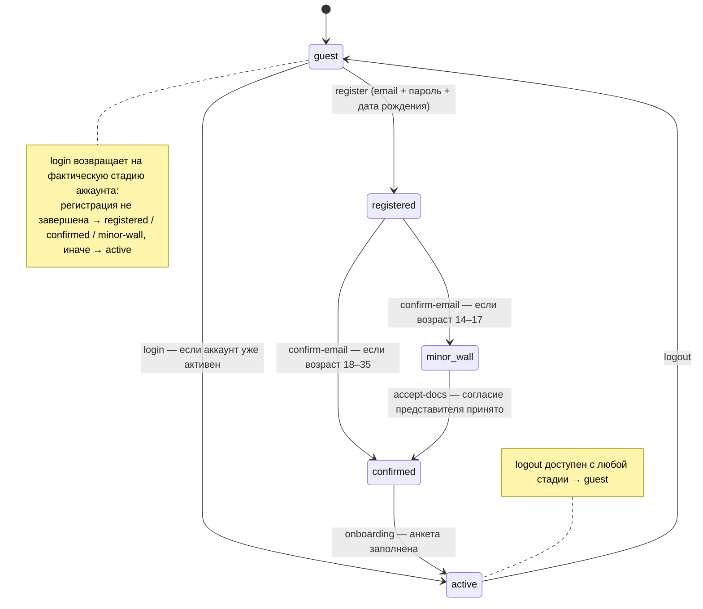

# Творцы РФ 2026 — Личный кабинет. Логика для передачи в разработку

> Документ описывает **всю бизнес-логику и флоу** прототипа ЛК так, чтобы по нему могли работать
> два человека: **верстальщик** (доводит вёрстку/экраны) и **бэкенд-разработчик** (реализует
> серверные функции и интегрирует со своим фронтом).
>
> Прототип — это React + Vite **без сервера**: вся логика крутится на клиенте и сохраняется в
> `localStorage`. Здесь зафиксированы правила, состояния и переходы — чтобы бэк понимал, *что
> должен делать сервер*, а верстальщик — *какие состояния экрана нужно нарисовать*.
>
> Все строковые ключи действий (`'register'`, `'submit-app'` …), названия полей и статусов даны
> **дословно** — это контракт, на который завязан текущий код.

> 🧭 **Как читать объём.** §3–§13 описывают **полный прототип / идеал** — как ЛК работает целиком (это
> референс). **Что реально входит в первый запуск, что упрощается, а что отложено — только в
> [§15](#15-объём-запуска-и-план-отсечения); решения по API — в [§14.4](#144-шесть-расхождений-нужно-решение-команды).**
> Видишь фичу в §3–§13 (доработка, полный инвайт, под-направления синтеза, отзыв заявки, статус
> «Итоги»…) — это **цель / прототип**; войдёт ли она в первый запуск — смотри §15.

---

## Содержание

1. [Как читать этот документ](#1-как-читать-этот-документ)
2. [Что это и на чём сделано](#2-что-это-и-на-чём-сделано)
3. [Глоссарий доменных понятий](#3-глоссарий-доменных-понятий)
4. [Стадии аккаунта (главный автомат состояний)](#4-стадии-аккаунта-главный-автомат-состояний)
5. [Роутинг и доступ к экранам](#5-роутинг-и-доступ-к-экранам)
6. [Сквозные сценарии (флоу)](#6-сквозные-сценарии-флоу)
7. [Экраны по одному](#7-экраны-по-одному)
8. [Модель данных](#8-модель-данных)
9. [Бизнес-правила](#9-бизнес-правила)
10. [Валидация полей](#10-валидация-полей)
11. [Что сейчас замокано и что нужно от бэкенда](#11-что-сейчас-замокано-и-что-нужно-от-бэкенда)
12. [Дизайн-токены и стили (для верстальщика)](#12-дизайн-токены-и-стили-для-верстальщика)
13. [Открытые вопросы и что стоит уточнить у заказчика](#13-открытые-вопросы-и-что-стоит-уточнить-у-заказчика)
14. [Интеграция с боевым API (Tvortsy API)](#14-интеграция-с-боевым-api-tvortsy-api)
15. [Объём запуска и план отсечения](#15-объём-запуска-и-план-отсечения)

---

## 1. Как читать этот документ

**Бэкенд-разработчику** важны разделы: [4 (автомат)](#4-стадии-аккаунта-главный-автомат-состояний),
[8 (модель данных)](#8-модель-данных), [9 (бизнес-правила)](#9-бизнес-правила),
[10 (валидация)](#10-валидация-полей), [11 (API-контракт)](#11-что-сейчас-замокано-и-что-нужно-от-бэкенда).
Там — какие сущности, какие правила и где их **обязательно проверять на сервере**.

**Верстальщику** важны разделы: [5 (роутинг)](#5-роутинг-и-доступ-к-экранам),
[6 (флоу)](#6-сквозные-сценарии-флоу), [7 (экраны)](#7-экраны-по-одному),
[12 (токены/стили)](#12-дизайн-токены-и-стили-для-верстальщика).
Там — какие у экрана состояния, что показывать в каждом, какими токенами оформлять.

Слово **«действие»** (action) в тексте — это событие в текущем клиентском сторе. Для бэка это
ориентир: *что* должно происходить и *с какими данными*. Маппинг действий на возможные эндпоинты —
в [разделе 11](#11-что-сейчас-замокано-и-что-нужно-от-бэкенда).

---

## 2. Что это и на чём сделано

**`tvortsy-lk`** — личный кабинет участника фестиваля «Творцы РФ 2026». Участник регистрируется,
заполняет анкету, подаёт заявку в одну из 5 номинаций (соло или командой), грузит материалы и
следит за статусом рассмотрения.

**Стек прототипа:**

| | |
|---|---|
| Фреймворк | React 18 + Vite 5 |
| Роутинг | `react-router-dom` v6, **BrowserRouter** (чистые пути, как у боевого фронта: `/cabinet`) |
| Состояние | один глобальный стор: `useReducer` + Context (`src/state/store.jsx`) |
| Хранение | `localStorage`, ключ `tvortsy-lk-state-v3` (нет бэкенда) |
| Стили | чистый CSS + CSS-переменные (`src/styles/*.css`), без фреймворка |
| Язык | весь UI, комментарии и коммиты — **на русском** |

> ✅ Роутинг **сведён с боевым близнецом** (`applications.tvortsy.online`): чистые пути (BrowserRouter).
> Для прода нужен SPA-fallback на хостинге — добавлен `vercel.json` (rewrite всех путей в
> `index.html`); в dev Vite это делает сам. Главное отличие от прода остаётся — реальный `/api`.

Запуск: `npm install` → `npm run dev`. В DEV-режиме внизу справа есть кнопка **demo** — через неё
открывается любое состояние (см. [раздел 7.7](#77-demopanel-инструмент-демонстрации)).

---

## 3. Глоссарий доменных понятий

| Термин | Значение |
|---|---|
| **Стадия (stage)** | Состояние аккаунта: `guest → registered → confirmed → active` (+ ветка `minor-wall`). Главный автомат, на нём завязан весь доступ. |
| **Номинация** | Направление конкурса: `audio` / `media` / `dance` / `visual` / `synth`. У каждой свои допустимые форматы файлов и лимит размера. |
| **Синтез (`synth`)** | Особая номинация «на стыке направлений»: требует **≥2 направлений**, грант ×2, формат MP4, суммарный лимит файлов 500 МБ. |
| **Заявка (application)** | Работа участника. Имеет статус, номинацию, материалы, состав команды, согласия. |
| **Черновик (draft)** | Заявка в статусе `draft`. Не считается «поданной», в лимит не входит. |
| **Цикл (CYCLE)** | Видимый таймлайн статусов поданной заявки: `submitted → review → admitted → results`. |
| **Доработка (rework)** | Боковой статус: заявку вернули, участник её «исправляет» (переводит обратно в черновик). |
| **Команда / приглашение** | У заявки `mode: 'team'` есть состав `members`. Приглашённый известен только по email, пока не примет приглашение. |
| **Капитан (captain)** | Владелец командной заявки. Заводит команду, приглашает, не может быть удалён. |
| **Стена согласий (minor-wall)** | Экран для участников **14–17 лет**: до кабинета нужно согласие законного представителя. |
| **Старший участник (35+)** | Старше 35 лет (`isSenior` ← `dobVerdict === 'old'`). Самостоятельно участвовать **нельзя** — только в составе команды по приглашению капитана, и таких не более доли состава (`SENIOR_SHARE`). |
| **Стадии файла** | Жизненный цикл загружаемого материала: `queue → progress → done`, плюс ошибочные `broken` / `over` / `error`. |

---

## 4. Стадии аккаунта (главный автомат состояний)

Весь доступ к приложению гейтится полем `state.stage`.



| Стадия | Что значит | Куда ведёт «домой» (`/`) |
|---|---|---|
| `guest` | Не авторизован | `/login` |
| `registered` | Ввёл email + пароль + дату рождения, **ждёт код подтверждения** | `/confirm` |
| `confirmed` | Email подтверждён, **нужно заполнить анкету** | `/onboarding` |
| `minor-wall` | 14–17 лет: **нужно согласие представителя** | `/wall` |
| `active` | Полноценный участник | `/cabinet` |

**Ключевые правила автомата:**

- **Возраст спрашивается на регистрации, а не в анкете.** Причина: до 18 лет нельзя
  зарегистрироваться без согласия, поэтому дату рождения собираем первой. Возраст определяет путь
  сразу после подтверждения почты.
- Решение по возрасту — функция `dobVerdict(dob)`:
  - `< 14` → **young** (жёсткий блок: «Участвовать можно с 14 лет»)
  - `> 35` → **old** (см. правило 35+ ниже)
  - `14–17` → **minor** (после подтверждения почты идёт на `minor-wall`)
  - `18–35` → **ok**
- **Старше 35 — только в команде по приглашению.** Самостоятельно зарегистрироваться 35+ **нельзя**;
  но если человек пришёл по ссылке-приглашению (`pendingInvite` есть), регистрация открывается — он
  заводит аккаунт, чтобы участвовать в чужой команде. На клиенте это разводит валидатор
  `vDobRegister(hasInvite)`: без приглашения `old` — блокирующее предупреждение, с приглашением —
  мягкое (не блокирует). После регистрации 35+ свою заявку завести не может (форма `/apply/:id` его
  редиректит в кабинет), но числится в команде капитана. См. [бизнес-правило 14](#9-бизнес-правила).
- **Вход (`login`) не перепрыгивает незавершённые шаги.** Если пользователь был на `registered` /
  `confirmed` / `minor-wall`, после входа он возвращается туда же, а не в кабинет.
- **`pendingInvite`** — если человек пришёл по ссылке-приглашению `/join/:id` будучи гостем, id
  заявки запоминается и переживает регистрацию/вход. После анкеты его ведёт не в кабинет, а обратно
  на экран приглашения.

---

## 5. Роутинг и доступ к экранам

Все маршруты объявлены в `src/App.jsx`. Роутер — **BrowserRouter** (чистые пути, как у боевого фронта).
Прод требует SPA-fallback (любой путь → `index.html`) — для Vercel это `vercel.json` в корне.

| Маршрут | Экран | Доступ |
|---|---|---|
| `/` | Index — редирект | По стадии → её «домашний» маршрут (таблица выше) |
| `/register` | Регистрация (шаг 1) | Публично |
| `/confirm` | Подтверждение email | Публично (но осмысленно для `registered`) |
| `/onboarding` | Анкета участника (шаг 2) | Публично (осмысленно для `confirmed`) |
| `/wall` | Стена согласий 14–17 | Публично (осмысленно для `minor-wall`) |
| `/login` | Вход | Публично |
| `/recovery` | Восстановление пароля | Публично |
| `/join/:id` | Приглашение в команду | **Публично** — авторизация происходит внутри экрана |
| `/cabinet` | Кабинет | Только `active` (иначе редирект на «домой» по стадии) |
| `/profile` | Профиль | Только `active` |
| `/apply/:id` | Форма заявки | Только `active` + заявка должна быть `draft` + автор не 35+ (иначе → `/cabinet`) |
| `/view/:id` | Просмотр заявки (read-only) | Только `active` (заявки нет → `/cabinet`) |
| `/success/:id` | Экран «Заявка подана» | Только `active` (заявки нет → `/cabinet`) |
| `*` | Любой неизвестный | Редирект как `/` |

Гард `RequireActive` оборачивает `/cabinet`, `/profile`, `/apply/:id`, `/view/:id`, `/success/:id`:
если стадия не `active` — выкидывает на «домашний» маршрут текущей стадии.

---

## 6. Сквозные сценарии (флоу)

### 6.1. Регистрация → активный участник (взрослый, 18–35)

```
/register  ──register──▶  /confirm  ──confirm-email──▶  /onboarding  ──onboarding──▶  /cabinet
 email+пароль+ДР          код (4 цифры)                 анкета участника
```

1. **`/register`**: вводит email, пароль (≥8, буква+цифра), дату рождения, ставит галочку согласия
   на обработку ПДн. Действие `register` → стадия `registered`.
2. **`/confirm`**: вводит 4-значный код (в прототипе — **любые 4 цифры**). Действие `confirm-email`
   → стадия `confirmed`. Есть таймер повторной отправки (60 с).
3. **`/onboarding`**: заполняет ФИО, телефон, национальность, город, место работы/учёбы. Действие
   `onboarding` → стадия `active`. → редирект в `/cabinet` (или в `/join/:id`, если был
   `pendingInvite`).

### 6.2. Регистрация несовершеннолетнего (14–17)

```
/register  ──▶  /confirm  ──confirm-email──▶  /wall  ──(модератор: accept-docs)──▶  /onboarding  ──▶  /cabinet
 (возраст 14–17 распознан)                    стена согласий, ждёт проверки документов
```

- На `/register` под датой рождения показывается баннер: «Понадобится согласие родителя».
- После подтверждения почты — не в анкету, а на **`/wall`**: участник сам загружает согласие
  представителя в своём кабинете-ожидании; статус документов `none → review → ok` (или `replace`,
  если модератор вернул на замену).
- Когда модератор принимает документы (действие `accept-docs`) → стадия `confirmed` → участник
  дозаполняет анкету → `active`.

> ⚠️ В текущем прототипе сама загрузка документа и решение модератора имитируются через demo-панель.
> На `/wall` показаны контакты фонда (`lk@tvortsy.online`, Telegram `@tvortsy_lk`).

### 6.3. Вход

```
/login  ──login──▶  по стадии:
                     registered → /confirm
                     confirmed  → /onboarding
                     minor-wall → /wall
                     есть pendingInvite → /join/:id
                     иначе      → /cabinet
```

- **Демо-логика:** принимается email `m.sokolova@mail.ru` (или совпадающий с `state.email`) + **любой
  непустой пароль**. Иначе — ошибка «Не удалось войти…».

### 6.4. Восстановление пароля (3 шага, целиком на экране `/recovery`)

```
шаг 1: email  ──▶  шаг 2: «проверь почту» (таймер 60 с, ссылка живёт 24 ч)  ──▶  шаг 3: новый пароль  ──▶  /login
```

В прототипе письмо не отправляется; переход между шагами — по демо-кнопке/таймеру. Стор не трогается.

### 6.5. Приглашение в команду

```
Капитан в форме заявки ──add-member(email)──▶ участник получает ссылку /join/:id
                                              │
   гость? → set-pending-invite → /login|/register → после анкеты возврат на /join/:id
   active? → видит приглашение, Принять/Отклонить
                                              │
   Принять  → respond-invite(tag:'confirmed') → имя подтягивается из профиля → /cabinet
   Отклонить→ respond-invite(tag:'declined')
   14–17 и не прошёл стену → сначала /wall
```

- Пока приглашённый не принял — в составе у него **только email, имя пустое**.
- На приглашение можно ответить и в кабинете (карточка/баннер приглашения), и на экране `/join/:id`.
- Фиксированный демо-id команды — `team-shum`, чтобы ссылка `/join/team-shum` работала из коробки.

> ⚠️ Известное ограничение прототипа: у свежезарегистрированного гостя по ссылке нет самой команды в
> сторе (она появляется только в demo-сценариях `invitee` / `invitee-minor`). На бэке это решается
> тем, что заявка-команда реально существует на сервере и подтягивается по `:id`.

### 6.6. Участник старше 35 (только в команде)

```
капитан приглашает 35+ ──▶ /join/:id (гость) ──set-pending-invite──▶ /register (с приглашением)
   35+ без приглашения → регистрация заблокирована («самостоятельно нельзя»)
   35+ с приглашением  → регистрация открыта → /confirm → /onboarding → возврат на /join/:id
                                                                              │
   принимает приглашение → respond-invite(confirmed) → числится в команде, своей заявки завести не может
```

- Самостоятельно (без `pendingInvite`) 35+ зарегистрироваться **не может** — `vDobRegister(false)`
  блокирует, на экране показывается красный баннер «Самостоятельно участвовать нельзя».
- По приглашению — регистрируется как обычный участник, но в кабинете вместо «+ Подать заявку»
  видит плашку «Только в команде», а форма `/apply/:id` ему недоступна (редирект в кабинет).
- **Квота капитана:** старших в команде — не более доли состава (`SENIOR_SHARE`, см.
  [правило 14](#9-бизнес-правила)); при превышении капитан не сможет подать заявку.

---

## 7. Экраны по одному

Для каждого экрана: что собирает, какие действия шлёт (дословные ключи), куда уходит, какие
состояния надо отрисовать.

### 7.1. Авторизационные экраны

Все используют общий макет **`AuthSplit`**: слева тёмный «постер-питч» (`#15151A`), справа светлая
панель с формой.

#### `/register` — Регистрация, шаг 1
- **Поля:** Email (`vEmail`), Пароль (`vPassword`), Дата рождения (`vDobRegister(hasInvite)`, маска
  `ДД.ММ.ГГГГ`), чекбокс согласия на обработку ПДн (обязателен; ведёт на `/docs/consent.html` и
  `/docs/privacy.html`).
- **Действие:** `register { email, dob }` (при всех валидных полях и поставленной галочке) → `/confirm`.
- **Состояния:** баннер «Понадобится согласие родителя» при возрасте 14–17; для **35+** — баннер
  «Участие — только в составе команды» (если пришёл по приглашению, `hasInvite`) либо красный
  «Самостоятельно участвовать нельзя» (без приглашения — регистрация заблокирована); ошибка, если не
  отмечено согласие; кнопка соц-входа показывает заглушку-тост «Демо: быстрый вход недоступен».
- **Правило 35+:** `hasInvite = !!state.pendingInvite`. Без приглашения `old` блокирует сабмит;
  с приглашением — мягкое предупреждение, регистрация проходит.
- **Навигация:** «Войти» → `/login`.

#### `/confirm` — Подтверждение email
- **Поля:** 4 ячейки кода (только цифры; авто-переход фокуса, Backspace на пустой ячейке — назад).
- **Действия:** `confirm-email` (когда введены все 4 цифры) → `/onboarding` (или `/wall`, если
  возраст 14–17); `change-email` → `/register`; `logout` → `/login`.
- **Состояния:** кнопка «Подтвердить» неактивна, пока не введены 4 цифры; таймер повторной отправки
  60 с, по нулю — кнопка «Отправить код ещё раз» (сброс на 60); показывается адрес `state.email`.
- **Правило:** код — **любые 4 цифры** (значение не проверяется).

#### `/onboarding` — Анкета участника, шаг 2
- **Поля:** Фамилия (`vName`), Имя (`vName`), Отчество (`vNameOpt`, необяз.), Телефон (`vPhone`,
  маска `+7 …`), Национальность (`vRequired`), Город (`vRequired`), Место работы/учёбы (необяз.).
- **Действие:** `onboarding { profile }` → стадия `active` → `/cabinet` (или `/join/:id`, если есть
  `pendingInvite`).
- Возраст здесь **не** спрашивается (он с регистрации).

#### `/wall` — Стена согласий (14–17)
- **Нет формы.** Информационный экран ожидания: контакты фонда, режим работы «Будни 10:00–19:00 (МСК)».
- **Действие:** `logout` → `/login`.
- **Состояния-редиректы:** если стадия уже `confirmed` → `/onboarding`; если `active` → `/cabinet`
  (или `/join/:id`).

#### `/login` — Вход
- **Поля:** Email (`vEmail`), Пароль (без жёсткой валидации — принимается любой непустой).
- **Действие:** `login { email }` → маршрут по стадии/`pendingInvite` (см. [6.3](#63-вход)).
- **Состояния:** общая ошибка входа на обоих полях; соц-вход — заглушка-тост.
- **Навигация:** «Зарегистрироваться» → `/register`; «Забыли пароль?» → `/recovery`.

#### `/recovery` — Восстановление пароля
- **Шаги:** 1) email (`vEmail`) → 2) «проверь почту» + таймер 60 с + демо-ссылка «открыть письмо» →
  3) новый пароль (`vPassword`) + повтор (`vMatch`).
- **Действий в сторе нет** (флоу до входа). По завершении → `/login`.

### 7.2. `/cabinet` — Кабинет

Главный экран активного участника. Read-only витрина + модалки подтверждения.

**Что показывает (ветвление):**
- **Пустой кабинет** (нет заявок): карточка-подсказка + кнопка «Подать заявку».
- **Приглашения** (где ты `invited`): баннер и/или карточка с именем капитана и кнопками
  «Принять» / «Отклонить» + ссылка «о приглашении» → `/join/:id`.
- **Черновики**: компактная карточка на каждый, прогресс «заполнено N из 4 разделов».
- **Командные заявки, где ты не капитан** (`confirmed`): компактная карточка — название команды,
  капитан, номинация, таймлайн статуса; заголовок и кнопка «Смотреть» ведут на read-only витрину
  `/view/:id`, есть «покинуть команду».
- **Поданные заявки**: пронумерованы 01/02, с таймлайном статуса; заголовок и «Смотреть» ведут на
  `/view/:id`; если статус `rework` — красный блок с `reworkNote` и кнопка «Исправить»; боковая
  подсказка по статусу.
- **Лимит:** если занятых слотов ≥ 2 — вместо «+ Подать заявку» показывается баннер «Все места
  заняты · 2 из 2» с подсказкой отозвать одну.
- **Старший участник (35+):** вместо «+ Подать заявку» — плашка «Только в команде»; пустое состояние
  и кнопка подачи заменены подсказкой про участие по приглашению. Своих заявок завести нельзя.

**Действия:**

| Кнопка/событие | Действие | Затем |
|---|---|---|
| «+ Подать заявку» | `create-draft { draft }` | → `/apply/:id` |
| «Принять» (приглашение) | `respond-invite { id, tag: 'confirmed' }` | — |
| «Отклонить» (приглашение) | `respond-invite { id, tag: 'declined' }` | — |
| Подтверждение «Отозвать заявку?» | `withdraw-app { id }` | — |
| Подтверждение «Удалить черновик?» | `withdraw-app { id }` | — |
| Подтверждение «Покинуть команду?» | `leave-team { id }` | — |
| «Исправить» (на доработке) | `reopen-app { id }` (→ статус `draft`) | → `/apply/:id` |
| Открыть черновик | — | → `/apply/:id` |

### 7.3. `/profile` — Профиль

**Левая колонка** — карточка профиля: аватар (инициалы), ФИО, город + email. Поля редактируются
инлайн (компонент `PRow`): клик «Редактировать»/«Добавить» → инпут → «Сохранить»/«Отмена» (Enter
сохраняет, Esc отменяет).

**Поля и доступность редактирования:**

| Поле | Валидатор | Маска | Редактируется |
|---|---|---|---|
| Фамилия | `vName` | — | да |
| Имя | `vName` | — | да |
| Отчество | `vNameOpt` | — | да |
| Телефон | `vPhone` | `maskPhone` | да |
| Место работы/учёбы | — | — | да |
| Дата рождения | — | — | нет (read-only) |
| Национальность | `vRequired` | — | нет (read-only) |
| Город | `vRequired` | — | нет (read-only) |

**Правая колонка** — две карточки:
- **«Вход в аккаунт»**: email (read-only), кнопка «Сменить пароль» (модалка: старый/новый/повтор;
  правило нового — `vPassword`), ссылка «Выйти из аккаунта» → `/login`.
- **«Быстрые входы»**: тумблеры VK ID и Яндекс ID.

**Действия:** `profile-patch { patch: { [поле]: значение } }` (сохранение поля); `social-toggle
{ key: 'vk' | 'yandex' }`.

> ⚠️ В прототипе «Сменить пароль» закрывает модалку и показывает тост, но **не шлёт действие в стор**
> — на бэке это должен быть реальный запрос смены пароля.

### 7.4. `/apply/:id` — Форма заявки

Доступна **только для заявки в статусе `draft`** и **только участникам до 35** (`isSenior` →
редирект в `/cabinet`: 35+ ведёт чужую командную заявку только на просмотр). Иначе — редирект в
`/cabinet`. Авто-сохранение: любое изменение шлёт `patch-app` с обновлением `updatedAt`. 4 раздела с
якорями `s01…s04` и скролл-навигацией.

**Раздел 01 — Номинация (`s01`)**
- 4 карточки (`audio`, `visual`, `dance`, `media`) + карточка «Синтез» с под-чипами направлений.
- Выбор: `patch-app { patch: { nomination, synthDirs: [] } }` (смена номинации **сбрасывает**
  `synthDirs`).
- Для `synth`: выбрать **≥2 направления** из `audio/media/dance/visual` (мульти-чипы). Меньше двух —
  раздел считается незаполненным.
- Номинация, уже занятая ранее **поданной** заявкой участника, должна быть **недоступна** для выбора
  (одна заявка на номинацию — см. [раздел 9, правило 3](#9-бизнес-правила)).

**Раздел 02 — Работа (`s02`)**
- **Название** (`title`), **Описание** (`description`, до 1000 знаков).
- **Файлы:** добавление через пикер/drag-drop. На добавление вызывается `classifyFile(name, sizeMB,
  nomination, files)` → стартовое состояние файла. Действия: `add-file`, `remove-file`, `patch-file`
  (докачать).
- **Ссылка на облако** (`link`) — поле появляется, **только если какой-то файл получил состояние
  `over`** (больше лимита).
- **Замена файла:** «заменить» → `remove-file` старого + добавление нового.

**Раздел 03 — Команда (`s03`)**
- Переключатель **Соло / Команда**. При переходе в команду шлётся `ensure-captain` (текущий
  пользователь становится капитаном).
- **Соло:** показываются данные из профиля (read-only участник-бар).
- **Команда:** название команды (`teamName`), список участников, приглашение по email
  (`add-member { member: { email, tag: 'invited', name: '' } }` после `vEmail`), копирование
  ссылки-приглашения, удаление участника (`remove-member`, капитана нельзя), «Напомнить».
- Теги участников: `in` (капитан-ты) / `confirmed` (принял) / `invited` (ждёт ответа) / `declined`
  (отклонил). У участников 35+ рядом — бейдж «35+» (`MemberRow` по `isSenior(member.dob)`).
- **Возрастная квота команды:** старших (35+) — не более доли состава (`teamSeniorStat(members)`,
  `SENIOR_SHARE`). При превышении (`over`) подача блокируется — см. ниже.

**Раздел 04 — Согласия и подача (`s04`)**
- 2 чекбокса: «С правилами фестиваля согласен» (`consents[0]`) и «Предоставляю неисключительную
  лицензию» (`consents[1]`). (Согласие на ПДн — отдельно, на регистрации.)
- **Подача:** `submit-app { id }` активна только когда `computeTodos(app)` пуст, не достигнут лимит
  слотов **и** не превышена возрастная квота старших в команде (`teamSeniorStat.over`). После —
  `nav('/success/:id')`.

**Что проверяет `computeTodos` (список «Осталось: …», блокирует подачу):**
выбрана номинация; для синтеза — ≥2 направления; есть название; есть описание; нет файла в загрузке;
нет «битого» файла; если файл `over` — указана ссылка; есть хотя бы один готовый файл (или `over` +
ссылка); нет файлов, не подходящих под номинацию; для команды — есть название и хотя бы один не-капитан;
нет приглашений без ответа; отмечены оба согласия.

### 7.5. `/view/:id` — Просмотр заявки (read-only)

Витрина поданной (или ведомой капитаном) заявки — после подачи форма недоступна, но автор должен
видеть, что отправил. Структура зеркалит форму: статус → 01 Номинация → 02 Работа → 03 Команда →
04 Согласия, всё статично. Открывается из кабинета (заголовок карточки и кнопка «Смотреть»).

- **Две роли экрана:**
  - **Автор** (своя заявка): видит все разделы, включая согласия; действия по статусу — «Отозвать
    заявку» (`withdraw-app`, для `submitted`/`review`), «Исправить и подать снова» (`reopen-app`,
    для `rework`).
  - **Участник команды** (не капитан): шапка «Заявка команды · только просмотр», раздел согласий
    скрыт (личная часть капитана), email неотвеченных приглашений не показывается (приватность);
    действие — «Покинуть команду» (`leave-team`).
- **Редиректы:** заявки по `:id` нет → `/cabinet`; черновик и ты не участник-команды → назад в
  форму `/apply/:id` (черновик дозаполняется в форме, а не здесь).

### 7.6. `/success/:id` — Заявка подана
- Иконка успеха, строка «Заявка №… · номинация · дата/время», таймлайн (статус `submitted`),
  подсказка «можно ещё отредактировать/отозвать, пока статус Подана».
- Кнопки: «К моим заявкам» → `/cabinet`; «Подать ещё одну» → `create-draft` → `/apply/:id` (неактивна,
  если достигнут лимит).
- Гард: если заявки по `:id` нет — редирект в `/cabinet`.

### 7.7. DemoPanel (инструмент демонстрации)

DEV-only кнопка **demo** внизу справа. **На прод не идёт** (монтируется только при `import.meta.env.DEV`).
Это эталон «всех достижимых состояний» — удобно как чек-лист для приёмки.

**Сценарии (`scenario { name }`):** `fresh` (новый пользователь), `maria-empty` (пустой кабинет),
`maria-full` (черновик + 2 заявки), `maria-team` (командная заявка), `team-shum-ready` (команда «Шум»
готова к подаче), `team-shum-review` (команда «Шум» на проверке), `invitee` (Кирилл 18+, приглашён),
`invitee-accepted` (Кирилл после принятия), `invitee-minor` (Тимур 14–17, приглашён), `minor` (Тимур
на стене согласий), `senior-reg` (35+ регистрируется по приглашению), `invitee-senior` (Олег 43,
приглашён), `captain-senior-ok` (капитан, старшие в пределах доли), `captain-senior` (капитан,
превышение доли старших — подача заблокирована).

**Действия модератора:** `accept-docs` (принять документы минора), `replace-minor-doc { doc }`
(вернуть документ на замену), `advance-status { id }` (продвинуть по циклу), `rework-app { id }`
(вернуть на доработку), `patch-file { … state }` (имитировать/оборвать загрузку),
`member-tag { id, memberId, tag }` (подтвердить приглашённого).

> 💡 Для бэка `accept-docs`, `advance-status`, `rework-app`, `member-tag` — это **действия
> модератора/администратора**, которым в проде нужна отдельная панель и права.

---

## 8. Модель данных

Источник истины — `src/state/store.jsx`. Ниже — формы объектов как есть в прототипе. Бэк может
переименовать поля, но семантику важно сохранить.

### 8.1. Корень состояния

```js
{
  stage: 'guest',                 // guest | registered | confirmed | minor-wall | active
  email: '',
  profile: { … },                 // см. 8.2
  minorDocs: {                    // документы несовершеннолетнего
    participation: 'none',        // none | review | ok | replace
    pdn: 'none',                  // none | review | ok | replace
  },
  minorDocNames: { … },           // имена загруженных файлов согласий (опц.)
  socials: { vk: true, yandex: false },
  apps: [ … ],                    // массив заявок, см. 8.3
  appSeq: 849,                    // счётчик следующего номера ТВ-2026-XXXX
  pendingInvite: null,            // id заявки-приглашения, ожидающего ответа после авторизации
}
```

### 8.2. Профиль участника

```js
{
  lastName: '',     // Фамилия
  firstName: '',    // Имя
  middleName: '',   // Отчество (необязательно)
  dob: '',          // дата рождения, строка «ДД.ММ.ГГГГ»
  phone: '',        // «+7 917 240-18-66»
  nationality: '',  // национальность (не «гражданство» — правка заказчика)
  city: '',
  work: '',         // место работы/учёбы (необязательно)
}
```

- **Полное имя** — порядок «Фамилия Имя Отчество».
- **Инициалы** — наоборот, **Имя+Фамилия**: «Соколова Мария» → «МС». (Важная договорённость, не
  перепутать порядок.)

### 8.3. Заявка

```js
{
  id: 'id…',                 // уникальный id
  num: 'ТВ-2026-0848',       // человекочитаемый номер
  status: 'draft',           // draft | submitted | review | rework | admitted | results
  nomination: null,          // null | audio | media | dance | visual | synth
  synthDirs: [],             // для synth: ≥2 из [audio, media, dance, visual]
  title: '',
  description: '',
  mode: 'solo',              // solo | team
  teamName: '',
  members: [ … ],            // см. 8.4
  files: [ … ],              // см. 8.5
  link: '',                  // ссылка на облако при превышении лимита размера
  consents: [false, false],  // [Положение фестиваля, лицензия]; ПДн — на регистрации
  reworkNote: '',            // текст замечания при возврате на доработку
  submittedAt: null,         // дата подачи «дд.мм.гггг»
  submittedTime: undefined,  // время подачи «чч:мм»
  updatedAt: '12:40',        // время последнего изменения
}
```

**Статусы и их отображение:**

| status | Подпись | Цвет/класс | В цикле? |
|---|---|---|---|
| `draft` | Черновик | нейтральный (`wait`) | нет (вне цикла) |
| `submitted` | Подана | обычный | да |
| `review` | На проверке | `wait` | да |
| `rework` | На доработку | ошибка (`err`) | боковой |
| `admitted` | Допущена | успех (`ok`) | да |
| `results` | Итоги | успех (`ok`) | да |

Видимый цикл таймлайна: `submitted → review → admitted → results`. Ориентировочные даты этапов
(`CYCLE_DATES`): submitted/review — июнь, admitted — июль–сентябрь, results — ноябрь.

### 8.4. Участник команды

```js
{
  id: 'id…',
  name: '',                  // пусто, пока приглашённый не принял (известен только email)
  email: 'k.dmitriev@inbox.ru',
  dob: '21.07.2001',         // дата рождения — для возрастной квоты 35+; пусто, пока не принял
  role: 'member',            // captain | member
  tag: 'invited',            // in | confirmed | invited | declined
}
```

- `in` — капитан/ты «в команде»; `confirmed` — приглашённый принял; `invited` — ждёт ответа;
  `declined` — отклонил.
- При принятии приглашения имя **и дата рождения** подтягиваются из профиля принявшего (`dob` нужен
  для подсчёта старших в команде; у `invited` его ещё нет — в квоту такие не идут).

### 8.5. Файл материала

```js
{
  id: 'id…',
  name: 'rabota_final.wav',
  sizeMB: 412,
  state: 'done',             // queue | progress | broken | done | error | over
  pct: 100,                  // прогресс загрузки 0–100
  errText: '',               // текст ошибки (для error/over/broken)
  note: '',                  // подсказка (например «в очереди»)
}
```

**Состояния файла:**

| state | Значение |
|---|---|
| `queue` | В очереди, загрузка начнётся автоматически (очередь последовательная: грузится один файл) |
| `progress` | Загружается (растёт `pct`) |
| `done` | Загружен успешно |
| `over` | Превышает лимит размера → требуется ссылка на облако |
| `error` | Неверный формат под номинацию |
| `broken` | Загрузка оборвалась — нужно докачать |

### 8.6. Справочник номинаций

| Ключ | Название | Форматы | Лимит | Особое |
|---|---|---|---|---|
| `audio` | Аудио | MP3 | 100 МБ | 1–2 трека |
| `visual` | Визуал | PDF, MP4, JPG | 300 МБ | до 12 работ |
| `dance` | Танец | MP4 | 500 МБ | видео 3–5 мин |
| `media` | Медиа | MP4 | 500 МБ | 1 фильм до 15 мин |
| `synth` | Синтез | MP4 | **500 МБ суммарно** | ≥2 направления, грант ×2 |

> ⚠️ Форматы/лимиты — источник истины `NOMINATIONS` в `store.jsx`. Они **расходятся** с текстом
> официального Положения (`docs/polozheniye.html`: у визуала JPEG/PNG, у синтеза подкаст MP3 и т.д.) —
> требуется свести (открытый вопрос, см. [раздел 13](#13-открытые-вопросы-и-что-стоит-уточнить-у-заказчика)).

---

## 9. Бизнес-правила

Правила, помеченные 🔒, **обязательно дублировать на сервере** — клиент им не защита.

1. 🔒 **Возрастной ценз 14–35.** До 14 — регистрация блокируется всегда. 14–17 — только через
   согласие представителя (стена `minor-wall`). **Старше 35 — самостоятельно нельзя**, но можно
   зарегистрироваться и участвовать **в составе команды по приглашению** (см. правило 14).
2. 🔒 **Лимит — 2 заявки «на всё»** (`APP_LIMIT`). Слот участника занимают и **свои поданные**
   заявки (solo или где он капитан; черновик можно удалить — не в счёт), и **членство в команде по
   приглашению**. Членство резервирует слот **с момента принятия приглашения** (`tag` confirmed/in),
   даже пока командная заявка ещё черновик: это обязательство перед капитаном. Единый счётчик —
   `countUsed(state, email)` (предикат `occupiesSlot`); проверяется в **двух** точках — при подаче
   (`submit-app`) и при **принятии приглашения** (`respond-invite`); без свободного слота ни то, ни
   другое не проходит. Следствие: у кого 2 личные поданы — в команду не вступит; кто в 2 командах —
   личную не подаст. На клиенте: кнопка «Подать заявку» скрыта + баннер «Все места заняты · 2 из 2»
   (кабинет), кнопка «Принять приглашение» заблокирована (`/join/:id` и карточка приглашения в ЛК).
3. 🔒 **Одна заявка на номинацию.** Нельзя подать **две заявки в одну и ту же номинацию** (включая
   «Синтез»). Среди *поданных* заявок участника номинации не повторяются — **в том числе номинация
   команды, в которой он состоит** (`takenNominations(apps, email)` учитывает занятые слоты). UX: в
   форме при выборе номинации те, что уже заняты, должны быть недоступны; на сервере — проверка при
   `submit`. Черновики можно держать любые, но второй `submit` в занятую номинацию не проходит.
   Вместе с лимитом 2 это значит: максимум 2 заявки — обе в разных номинациях.
4. 🔒 **Полнота заявки перед подачей** — все пункты `computeTodos` закрыты (см. [7.4](#74-applyid--форма-заявки)).
5. 🔒 **Валидация файла под номинацию** (`classifyFile`):
   - формат не из списка номинации → `error` («Формат … не подходит — загрузи …»);
   - размер больше лимита → `over` (для обычных номинаций — на файл; для `synth` — **суммарно по
     всем файлам** заявки) → требуется ссылка на облако.
6. **Синтез** требует ≥2 направлений; формат MP4, лимит 500 МБ — суммарный по всем файлам заявки.
7. **Смена номинации** сбрасывает `synthDirs` и может сделать ранее загруженные файлы «не
   подходящими» (`misfitFiles`) — тогда раздел просит заменить файлы.
8. **Очередь загрузки последовательная** — одновременно грузится один файл, остальные в `queue`.
9. **Согласия:** 2 чекбокса в форме (Положение + лицензия) обязательны для подачи; согласие на ПДн —
   на регистрации.
10. **Команда:** приглашённый известен только по email до принятия; имя приходит из его профиля при
    `confirmed`. Капитана нельзя удалить. Приглашения **бессрочные** (правка заказчика — без дат).
11. **Доработка (`rework`)**: участник жмёт «Исправить» → заявка снова `draft` (`reopen-app`),
    лимит при этом не трогается (она и так была подана). После правок — снова `submit-app`.
12. **Отзыв/удаление:** `withdraw-app` удаляет заявку из списка (и для поданной, и для черновика).
    Отозвав заявку, участник освобождает её номинацию — в неё снова можно подать.
13. **Автосохранение** черновика — при каждом изменении (в прототипе debounce 400 мс к localStorage).
14. 🔒 **Старший участник (35+) — только в команде.** Самостоятельно участвовать может только до 35
    (`SENIOR_AGE = 35`, `isSenior` ← `dobVerdict === 'old'`). Старше — лишь в составе команды по
    приглашению. Дополнительно: **старших в команде — не более доли состава** (`SENIOR_SHARE = 0.2`,
    `teamSeniorStat`: `max = floor(len × share)`, превышение `over` блокирует `submit-app`).
    Участники без даты рождения (приглашённые, ещё не принявшие) в подсчёт не идут. Проверки на
    клиенте: регистрация (`vDobRegister`), редирект формы для 35+, блок подачи при `over`. **Доля —
    20%** (`SENIOR_SHARE = 0.2`, `floor`), как в Положении (см. [раздел 13](#13-открытые-вопросы-и-что-стоит-уточнить-у-заказчика));
    **серверная валидация правила — план Б** (если не успеваем — только клиентская проверка).

---

## 10. Валидация полей

Слой `src/state/validation.js`. Валидатор возвращает `null | {error} | {warn} | {warn, block}`:
`error` — жёсткая ошибка (красный, блокирует); `warn` — мягкое предупреждение (янтарный, по
умолчанию **не** блокирует); `warn + block` — предупреждение, которое всё же блокирует.

| Валидатор | Правило | Сообщения (примеры) |
|---|---|---|
| `vEmail` | непусто, есть `@`, без пробелов, формат `x@y.z` | «Укажи почту», «В адресе не хватает “@”» |
| `vPhone` | 11 цифр, начинается с 7 или 8 | «В номере не хватает цифр», «Начни с +7 или 8» |
| `vName(msg)` | непусто; только буквы (рус/лат), дефис, апостроф; одно слово | «Только буквы — без цифр», «Одно слово — без пробелов» |
| `vNameOpt` | как `vName`, но пусто — допустимо (для отчества) | — |
| `vDob` | формат `ДД.ММ.ГГГГ`; **<14 и >35 — блокирующее предупреждение** | «Формат: ДД.ММ.ГГГГ», «Участвовать можно с 14 лет» |
| `vDobRegister(hasInvite)` | гейт регистрации: `<14` блок; `>35` — блок **без** приглашения, мягкое предупреждение **с** приглашением (`hasInvite`) | «Самостоятельно участвовать можно до 35 лет — старше только по приглашению…» |
| `vPassword` | ≥8 символов, ≥1 буква, ≥1 цифра | «Добавь ещё N — пароль от 8 символов» |
| `vRequired(msg)` | непусто | «Заполни поле» |
| `vMinLen(n)` | не короче n | «Слишком коротко — нужно не меньше N символов» |
| `vMatch(other)` | совпадает с другим значением | «Пароли не совпадают» |

**Маски ввода:** `maskPhone` → `+7 917 240-18-66` (8 → 7, авто-код); `maskDob` → `ДД.ММ.ГГГГ`.
Разделители ставятся только перед следующей цифрой — Backspace работает естественно.

**Поведение поля (`useField` + `<Field>`):** ошибка/предупреждение показываются после `blur`
(`touched`) либо при `eager`; зелёная галочка успеха — «живо» по мере ввода; при сабмите
`revealInvalid()` раскрывает ошибки всех полей и фокусирует первое невалидное.

---

## 11. Что сейчас замокано и что нужно от бэкенда

Прототип всё делает на клиенте. Ниже — что подменено и какой серверный функционал за этим стоит.
**Эндпоинты — это предложение** (зеркало действий стора); адаптируйте под свой API.

### 11.1. Что сейчас имитируется

| Подсистема | Сейчас в прототипе | Нужно на сервере |
|---|---|---|
| Регистрация/вход | принимается демо-email + любой пароль | реальная аутентификация, хранение пароля (хэш), сессии/токены |
| Код подтверждения email | любые 4 цифры | генерация и проверка кода, отправка письма, срок жизни, повторная отправка |
| Восстановление пароля | флоу без бэка, письмо не уходит | письмо со ссылкой (TTL 24 ч), сброс пароля |
| Загрузка файлов | имитация прогресса по таймеру | реальная загрузка (в проде — presigned multipart), проверка формата/размера, антивирус |
| Лимит/полнота заявки | проверка на клиенте | 🔒 проверка при `submit` на сервере |
| Возрастной ценз + квота 35+ | `dobVerdict` / `teamSeniorStat` на клиенте | 🔒 проверка на сервере (в т.ч. доля старших в команде) |
| Согласие несовершеннолетнего | статусы меняет demo-панель | приём файла согласия, модерация, статусы `review/ok/replace` |
| Действия модератора | demo-панель | админ-панель с правами (продвижение статусов, доработка, приём документов, подтверждение приглашённых) |
| Соц-входы (VK/Яндекс) | тосты-заглушки | реальный OAuth |
| Приглашения | в сторе клиента | заявка-команда на сервере, отправка письма-приглашения со ссылкой `/join/:id`, ответ приглашённого |

### 11.2. Предлагаемый маппинг действий → API

> Формат: `действие стора` → `HTTP метод путь` (что делает). 🔒 — правило проверять на сервере.

**Аутентификация и аккаунт**
- `register {email, password, dob}` → `POST /auth/register` — создать аккаунт, отправить код. 🔒 ценз 14–35 (35+ — только при наличии приглашения, дальше участие лишь в команде).
- `confirm-email {code}` → `POST /auth/confirm` — проверить код; вернуть следующую стадию (для 14–17 → `minor-wall`, иначе `confirmed`).
- (повтор кода) → `POST /auth/resend-code`
- `change-email` → `PATCH /auth/email` (или повторная регистрация)
- `login {email, password}` → `POST /auth/login` — вернуть стадию + токен.
- `logout` → `POST /auth/logout`
- восстановление → `POST /auth/recovery/request {email}` и `POST /auth/recovery/reset {token, password}`

**Профиль**
- `onboarding {profile}` → `PUT /profile` (первичное заполнение, стадия → `active`)
- `profile-patch {patch}` → `PATCH /profile`
- смена пароля → `POST /profile/password`
- `social-toggle {key}` → `POST /profile/socials/:provider` (OAuth)

**Несовершеннолетний**
- `upload-minor-doc {doc, name}` → `POST /minor/docs/:doc` (статус → `review`)
- `accept-docs` / `replace-minor-doc` → действия модератора: `POST /admin/minor/:userId/accept` / `.../replace`

**Заявки**
- `create-draft` → `POST /applications` (создать черновик, вернуть `id` и `num`)
- `patch-app {id, patch}` → `PATCH /applications/:id` (автосохранение)
- `submit-app {id}` → `POST /applications/:id/submit` — 🔒 лимит 2 + уникальность номинации + полнота + ценз + возрастная квота команды (доля 35+).
- `withdraw-app {id}` → `DELETE /applications/:id` (отзыв/удаление черновика)
- `reopen-app {id}` → `POST /applications/:id/reopen` (из `rework` в `draft`)
- модерация: `advance-status` / `rework-app` → `POST /admin/applications/:id/status`

**Файлы**
- `add-file` → инициировать загрузку (presigned URL); 🔒 `classifyFile` на сервере (формат/размер, для synth — суммарно).
- `patch-file` / `remove-file` → обновить/удалить материал.

**Команда / приглашения**
- `ensure-captain` → создаётся при переводе заявки в `team` (текущий пользователь — капитан).
- `add-member {email}` → `POST /applications/:id/invite {email}` — отправить письмо со ссылкой `/join/:id`.
- `remove-member` → `DELETE /applications/:id/members/:memberId`
- `set-pending-invite` → клиентское (запомнить приглашение до авторизации).
- `respond-invite {id, tag}` → `POST /applications/:id/invite/respond {accept}` — 🔒 отвечает владелец email-приглашения; при принятии подтянуть имя из профиля.
- `leave-team {id}` → `POST /applications/:id/leave`
- `member-tag` → модераторское подтверждение приглашённого.

---

## 12. Дизайн-токены и стили (для верстальщика)

Стиль — «язык лендинга TV.fig»: белый фон без «стекла», тонкие линии (1px), mono-кикеры (JetBrains
Mono), Golos Text крупно, тёмные плиты-питчи `#15151A`, sky-кнопки, пиксельные мозаики. CSS чистый,
подключается один раз в `src/main.jsx` в порядке: `tokens.css → base.css → forms.css → app.css`.

**Используйте токены, а не «магические» значения.** Все — в `src/styles/tokens.css`:

- **Цвета:** `--w` (#FFFFFF), `--ink` (#000), `--plate` (#15151A, тёмные полотна), `--paper`
  (#F0F8FD), `--sky`/`--sky-2` (голубые кнопки), `--accent` (#5B9BC9), `--ink-blue` (#23425A — текст
  на голубом), `--ok`/`--err`/`--warn` (статусы), `--line`/`--guide` (тонкие линии).
- **Радиусы (шкала):** `--r-xs` 6 / `--r-sm` 12 / `--r-md` 16 / `--r-lg` 22 / `--r-xl` 28 /
  `--r-2xl` 36 / `--r-pill` 999.
- **Отступы (сетка 4px):** `--sp-1`…`--sp-12` (4…48).
- **Шрифты:** `--font-sans` (Golos Text), `--font-mono` (JetBrains Mono), `--font-jbm` (псевдоним
  `--font-mono`, оставлен ради совместимости с местами, где он уже используется).
- **Типошкала:** `--fs-2xs` 11 … `--fs-3xl` 44 (единые ступени кегля; дисплейные заголовки —
  отдельно литералами, `clamp(40px, 6.5vw, 76px)` у крупных тайтлов).

**Готовые UI-примитивы — `src/components/ui.jsx`** (берите их, прежде чем писать новую разметку):

| Компонент | Что это |
|---|---|
| `Field` | Текстовый инпут/textarea: лейбл, хинт, статус (error/warn/ok), счётчик символов |
| `PasswordInput` | Пароль с глазиком-переключателем |
| `Chips` | Группа чипов (одиночный/мульти-выбор) — направления синтеза, тумблеры |
| `Check` | Чекбокс с подписью |
| `FileRow` | Строка файла: прогресс, статус, кнопки докачать/заменить/удалить |
| `MemberRow` | Строка участника команды: инициалы, имя/email, роль, тег, напомнить/удалить |
| `Modal` | Затемнение + карточка-диалог |
| `StatusTimeline` | Таймлайн цикла заявки (submitted → review → admitted → results) |
| `StatusTag` | Бейдж статуса с точкой |
| `Pix` / `Wing` | Декоративные пиксельные мозаики / «крылья» |

Также: `Nav` (шапка кабинета + меню профиля), `AuthSplit` (тёмный постер + светлая форма для auth),
`NominationCards` (карточки номинаций + карточка синтеза).

**Принцип шапок экранов:** каждый экран показывает только своё. Идентичность (имя/аватар) живёт в
`Nav`, анкетные данные (email/город/возраст) — в `Профиле`; не дублируйте их заголовками на других
экранах. Заголовки кабинета и формы — одна шкала.

**Адаптив:** мобильная отсечка ~720px (в форме чипы-разделы вместо якорной навигации). Контейнеры —
с тонкими 1px-линиями.

---

## 13. Открытые вопросы и что стоит уточнить у заказчика

Это **не баги прототипа**, а места решений для прода. Часть теперь **закрыта** (помечено _решено_),
часть ещё **может измениться**, часть осознанно **отдаём позже** — не в этой итерации.

**Даты и сроки** — _могут ещё поменяться_
- **Приём заявок:** открытие — **20.06.2026**, дедлайн — **20.10.2026** (после дедлайна приём
  закрываем). Даты ещё могут сдвинуться; в коде этапы пока захардкожены («июнь / июль–сентябрь /
  ноябрь») — свести с финальными.
- Точные **тексты согласий** (Положение, лицензия, ПДн) и ссылки на документы — _открыто_.

**Правила номинаций**
- **Возрастная квота старших в команде — _решено_: не более 20%** (`SENIOR_SHARE = 0.2`, округление
  `floor`), как в Положении: «превышение возрастной границы допустимо не более чем у 20% участников»
  (Младшая/Средняя/Старшая группы). _Нюанс на будущее:_ для «Смешанной группы» Положение разрешает до
  **50%** — плоский `0.2` этого пока не различает.
- **Форматы/лимиты файлов — _открыто_ (решение человека).** В коде (`NOMINATIONS`) они расходятся с
  Положением (`docs/polozheniye.html`: видео MP4 ≤3 мин, подкаст MP3 ≤7 мин и т.д.) — выбрать источник
  истины и свести значения **до** enforce формата/размера на `submit`.
- Лимиты-подписи («до 12 работ» у визуала, «1–2 трека» у аудио, длительности видео) — сейчас бейджи,
  **не enforced**. Проверять ли на сервере? _открыто_.

**Команда** — _решено_
- **Отзыв командной заявки убивает заявку** целиком (для всех участников); передачи капитанства нет.
- **Участник (не капитан) ничего не редактирует** — только просмотр (`/view`).
- **Письмо-приглашение есть** (`emails/invite.html`); срок приглашения — бессрочный.

**Несовершеннолетние** — _согласие родителей в этой итерации не автоматизируем_
- Участники **14–17 остаются в ЛК**. Согласие законного представителя на эту итерацию **валидируем
  вручную** — конкретный способ ещё **не определён** (сейчас прорабатывается в макетах/прототипе).
  Полноценный приём и модерация согласий (загрузка документов, статусы, SLA) и защита ПДн
  несовершеннолетних (152-ФЗ) — **отдельным этапом позже**.

**Уведомления** — _позже_
- **Уведомления** (email/пуш) при смене статуса, доработке, ответе на приглашение — **нужны, но не в
  этой итерации**.

**Техническое**
- **Админ/модераторская панель** — **позже**, отдельная, с правами.
- Хранилище файлов, антивирус, ограничение типов на сервере, что делать с `over`-файлами (только
  облачная ссылка?) — _открыто_.
- Аналитика, доступность (a11y), мультиязычность — в прототипе не заложены.
- **Роутинг — _решено/сведено_:** прототип уже на чистых путях (BrowserRouter), как прод-близнец; для
  прода нужен SPA-fallback (`vercel.json`).

---

## 14. Интеграция с боевым API (Tvortsy API)

Боевой близнец `applications.tvortsy.online` уже задеплоен и имеет работающий API. Этот раздел —
**мост** между моделью прототипа и их API: маппинг полей, маппинг действий и шесть расхождений,
которые нельзя решить кодом — нужно решение команды.

**Стек их бэка:** FastAPI · JWT (access + refresh) · nginx · ошибки в формате `{code, message}`.
**Первоисточник контракта** — их Swagger: `https://applications.tvortsy.online/api/docs` (для людей)
и `…/api/openapi.json` (сырьё). Спека описывает *форму* (пути, поля, типы), но не *значения и
правила* — реальные лимиты, валидные строки и форматы снимаются с живого API или уточняются у их
бэкендера.

### 14.1. Доступ и авторизация

- **JWT.** `POST /auth/login {email, password}` → `{access_token, refresh_token}`. `access` кладём в
  каждый защищённый запрос: `Authorization: Bearer <access_token>`. На `401/403` → `POST /auth/refresh`
  (по refresh) → новая пара → повтор запроса. Без токена API отдаёт `403 {"code":"access_denied",
  "message":"JWT token is required."}`.
- **Стадии аккаунта в токене нет.** Наш `state.stage` после входа надо **выводить** из `GET /users/me`
  (`email_verified`, `requires_guardian_consent`) + состояния заявок — это клиентская производная.
- **CORS.** Локально — Vite dev-proxy (`server.proxy: { '/api': { target: их домен, changeOrigin } }`);
  прод — их allowlist или reverse-proxy. Подробнее — [раздел 13](#13-открытые-вопросы-и-что-стоит-уточнить-у-заказчика) и обсуждение интеграции.

### 14.2. Маппинг полей (наше ↔ их API)

Две разницы: **(а)** чистый регистр (`lastName` → `last_name`) — авто; **(б)** переименования
(`title` → `work_title` и т.д.) — по таблице. ❗ = уточнить/сконвертировать.

**Профиль**

| Наше (camelCase) | Их (snake_case) | Примечание |
|---|---|---|
| `lastName` | `last_name` | |
| `firstName` | `first_name` | |
| `middleName` | `middle_name` | |
| `dob` | `birth_date` | ❗ формат: у нас «ДД.ММ.ГГГГ», у них вероятно ISO «ГГГГ-ММ-ДД» — конвертировать |
| `phone` | `phone` | |
| `nationality` | `nationality` | |
| `city` | `city` | |
| `work` | — | поля нет в их схеме (расхождение №5) |
| ПДн (на регистрации) | `consent_personal_data`, `consent_privacy_policy` | у них два флага |

**Заявка**

| Наше | Их | Примечание |
|---|---|---|
| `title` | `work_title` | |
| `description` | `work_description` | |
| — | `annotation` | есть у них, нет у нас — доп. поле (можно игнорировать или задействовать) |
| `mode` (`solo`/`team`) | `participation_type` | ❗ их допустимые значения уточнить |
| `teamName` | `team_name` | |
| `members[]` (с email/tag) | `team_member_ids[]` | id юзеров из `/users/search?email` (расхождение №1) |
| `link` | `external_work_link` | сюда же ложится наш `over`-файл → облачная ссылка ✅ |
| `consents[bool,bool]` | `consents` | |
| `synthDirs[]` | — | поля нет (расхождение №3) |
| `files[]` | `files_to_upload` | через слот+confirm (см. ниже) |
| `num`, `status`, `submittedAt` | серверные | приходят в ответе `ApplicationDetailResponse` |

**Файл** (у них — presigned-загрузка)

| Наше | Их | Примечание |
|---|---|---|
| `name` | `filename` | |
| `sizeMB` | `size_bytes` | ❗ МБ → байты |
| (тип) | `content_type` | |
| `state` | `status` | |

Поток: запрос слота `{purpose, filename, content_type, size_bytes}` → ответ с `upload_url`
(presigned) → заливаем файл в хранилище → `POST /applications/{id}/files/{file_id}/confirm`.

### 14.3. Маппинг действий → эндпоинты

| Наше действие | Их эндпоинт | Примечание |
|---|---|---|
| `register` | `POST /auth/register` | **весь профиль сразу** (см. 14.4 №7 — перестройка флоу) |
| `confirm-email` | `POST /auth/verify-email` `{email, code}` | повтор кода — `POST /auth/resend-code` |
| (минор) загрузка/`accept-docs` | `POST /auth/register/guardian-consent/confirm` | |
| `login` / `logout` | `POST /auth/login` → токены · `POST /auth/logout` · `POST /auth/refresh` | токены выдаёт login (issuance на register — ❗ уточнить) |
| `onboarding` | — | профиль собирается на `register`; отдельного шага у них нет |
| `profile-patch` | `PATCH /users/me` | только `phone/city/nationality` (расхождение №5) |
| смена пароля | `POST /users/me/change-password` | |
| `create-draft` + `patch-app` | `PUT /applications/draft` | upsert по `id` (наш автосейв) |
| список заявок | `GET /applications/me` | |
| одна заявка | `GET /applications/{id}` | |
| лимиты | `GET /applications/limits` | **раздельные** `solo_*` / `team_*` (расхождение №4) |
| `submit-app` | `POST /applications/{id}/submit` | |
| `add-file` / `patch-file` | слот + `POST …/files/{id}/confirm` | presigned |
| `add-member` | `GET /users/search?email` → id в `team_member_ids` | без invite-флоу (расхождение №1) |
| модерация (`advance-status`/`rework`) | `PATCH /admin/applications/{id}/status` | + `GET /admin/stats/by-nomination` |
| `withdraw-app` / `reopen-app` / `leave-team` | — | эндпоинтов нет (расхождение №2) |

### 14.4. Шесть расхождений (нужно решение команды)

Колонка **«Решение»** — что **мы предлагаем** по каждому расхождению (для бэка: что делать с API), финально **согласовать с командой**. **Сроки,
тиры T0/T1/T2 и очередь упрощения этих пунктов — в [§15](#15-объём-запуска-и-план-отсечения)** — здесь их не повторяем.

> _Метки по тексту:_ ✅ решено (по-нашему) · 🟡 «план Б» — fallback, режем **только если не успеваем** · **T2 / «следующая итерация»** — отложено · ❓ открыто, решает человек.

| # | Наша модель (прототип) | Их API сейчас | Варианты | Решение |
|---|---|---|---|---|
| 1 | Приглашение по email → ожидание → принять/отклонить (`respond-invite`, экран `/join/:id`), теги `in/confirmed/invited/declined` | Только `team_member_ids` — добавление **готовых** юзеров по id (поиск через `/users/search?email`). Инвайта/акцепта нет | (а) урезать до «добавить найденного по email», без accept-флоу и `/join`; (б) их бэк добавляет invite/accept-эндпоинты | 🟡 **Цель — полный инвайт+accept** (пригласить→принять, `/join`). **План Б, только если бэк не успевает к сроку** — «капитан-онли»: капитан вписывает участников вручную (имя/роль), без аккаунтов/инвайтов. Деградация «по email-поиску» **отклонена — ПДн** (раскрывает, кто зарегистрирован; добавляет без согласия). Бэку под капитан-онли: поле `team_members` `{name, role}` или на тест нести состав в `annotation` (`team_member_ids` пустой). См. [§15.4](#154-решения-по-командам-и-синтезу) |
| 2 | Отзыв (`withdraw-app`), «Исправить» (`reopen-app`), выход из команды (`leave-team`) | Эндпоинтов нет (есть только admin-смена статуса) | (а) их бэк добавляет withdraw/reopen/leave; (б) убрать кнопки из UI | **Три судьбы:** (1) доработка (`rework`/«Исправить») → **T2, следующая итерация** (кабинеты экспертов/админа), сейчас не строим; (2) отзыв поданной (`withdraw-app`) → **🟡 план Б**, режем только если не успеваем; (3) выход из команды (`leave-team`) → **часть командной фичи** (живёт и режется вместе с командами, см. №1). Удаление черновика — остаётся (мелкий `DELETE`) |
| 3 | Синтез: `synthDirs` (≥2 направления), правила вокруг них | Поля под направления в `draft` нет | (а) их бэк добавляет поле (напр. `synth_directions`) + правило ≥2; (б) синтез без под-направлений | 🟡 **Цель — синтез с под-направлениями** (`synthDirs`, ≥2): просим бэк добавить поле `synth_directions` (массив) — оно крошечное и **нужно на будущее (роутинг заявок к экспертам по направлениям)**, желательно завести **сразу** (копить данные, без бэкафилла). **План Б, только если поле не успеют** — синтез без под-выбора (`nomination = synth`); направления аддитивны, докрутим позже (или разметим вручную на тест-батче). См. [§15.4](#154-решения-по-командам-и-синтезу) |
| 4 | **Общий** лимит 2 «на всё» (`countUsed`, включая членство в команде по приглашению) | **Раздельные** бюджеты `solo_max`/`team_max` (`/applications/limits`) | (а) принять их раздельную модель (переписать наш лимит/`countUsed`); (б) согласовать общий счётчик | ✅ **По-нашему** — общий счётчик 2. Бэк реализует общий лимит с учётом, что **членство в команде занимает слот с момента принятия** (см. правило 2), а не просто «считать поданные». Несложно |
| 5 | Инлайн-правка `lastName/firstName/middleName/phone/work`; есть поле `work` | `PATCH /users/me` только `phone/city/nationality`; поля `work` нет; имя/ДР не редактируются | (а) сузить наш профиль под их API, убрать `work`; (б) их бэк расширяет PATCH + добавляет `work` | 🟡 **Цель — править и имя/`middle_name`/`work`** (бэк расширяет `PATCH /users/me` + добавляет поле `work`, несложно). **План Б, только если бэк не успевает** — редактируем лишь `phone/city/nationality` (как умеет их текущий PATCH) |
| 6 | 35+ только в команде, ≤ доли состава (`teamSeniorStat`, блокирует submit) | На бэке не отражено | (а) клиентская проверка + их бэк валидирует на submit; (б) убрать правило | 🟡 **Доля — 20% решена** (см. [§13](#13-открытые-вопросы-и-что-стоит-уточнить-у-заказчика)). **Серверная валидация — план Б:** клиентская проверка обязательна, серверная — если успеваем |

### 14.5. Дополнительно (всплывёт при интеграции, помимо шести)

- **Форма регистрации.** У нас 2 шага: `register` (email + пароль + ДР) → `onboarding` (остальной
  профиль). У них **весь профиль на `/auth/register`**, а `verify-email` — после. Нужно либо собрать
  профиль до отправки `register`, либо согласовать порядок с их флоу.
- **Роутинг.** ✅ Уже сведено: у нас теперь BrowserRouter (чистые пути), как у них. SPA-fallback на
  прод — `vercel.json` (rewrite в `index.html`); их хостинг должен отдавать `index.html` на любой путь.
- **Значения, не форма.** Реальные числа лимитов (`solo_max`/`team_max`), валидные строки
  `nomination`/`participation_type`, формат `birth_date` — снять с живого API или у их бэкендера
  (спека их не фиксирует).

> Источник этого раздела — спека `…/api/openapi.json` (снято 2026-06-15). Перед стартом интеграции
> сверьте с актуальным Swagger: API может дорасти.

---

## 15. Объём запуска и план отсечения

> 📌 **Это предложенные приоритеты, не директива.** Раскладка T0/T1/T2 и очередь упрощения —
> рекомендация со стороны прототипа; финально **согласуем с принимающей командой** под её реальные
> силы и сроки. Что-то можно переставить — скажете, что реально.

Запуск = открытие приёма заявок (ориентир ≈ 20.06.2026). Принцип передачи: отдаём **идеал как цель**,
но с приоритетами — чтобы под дедлайн резать осознанно и по порядку, **не ломая запуск**. **Сами
решения по 6 расхождениям — в [§14.4](#144-шесть-расхождений-нужно-решение-команды);** §15 их не
переписывает, а раскладывает по срокам (T0/T1/T2 + очередь упрощения в [§15.5](#155-что-упрощаем-если-не-успеваем-к-запуску-дедлайн--20-октября)).

> 🟢 **Главное:** launch-critical ядро почти целиком **уже есть в их API** (см. [§14.3](#143-маппинг-действий--эндпоинты)).
> Риск «не успеть» — это команды / синтез / правило-35+, **не** ядро. Запуск вовремя реалистичен.

### 15.1. T0 — без этого приёма заявок нет (эндпоинты у них уже есть)

- Регистрация (полный профиль) + `verify-email` + `login`/`refresh`.
- **Восстановление пароля** — нужно на запуск (флоу есть в прототипе, §6.4/§7.1). Если эндпоинтов нет в их API — добавить, не откладывать.
- Возрастной ценз 14–35.
- Черновик заявки: создать/автосейв (`PUT /applications/draft`).
- Файлы: загрузка (slot + confirm); `over` → `external_work_link`.
- Согласия (`consents`).
- Лимит 2 + одна-на-номинацию + полнота. _Стыковка:_ их API считает лимиты **раздельно** (`solo_max`/`team_max`), а у нас один **общий счётчик на 2** — бэк сводит к общему (расхождение №4, несложно).
- Подача (`submit`).
- **Синтез** — цель с под-направлениями (бэк добавляет поле `synth_directions`); **план Б, только если не успеют** — без под-выбора (см. [§15.4](#154-решения-по-командам-и-синтезу)).
- **Команды** — нужны на запуск. Цель — полный инвайт (пригласить→принять); **план Б, только если не успеваем** — «капитан-онли» (см. [§15.4](#154-решения-по-командам-и-синтезу)).

### 15.2. T1 — важно, но режется деградацией (не поломкой)

| Фича | Идеал | Деградация, если не успевают |
|---|---|---|
| Команды (№1) | инвайт по email + принять/отклонить + `/join` | **капитан-онли** (состав вручную; выход из команды тоже отпадает) |
| Синтез-направления (№3) | поле + правило ≥2 | синтез **без** под-направлений |
| Редактирование профиля (№5) | имя/`work` тоже | только `phone/city/nationality` (их текущий PATCH) |
| Правило 35+ ≤ доли (№6) | клиент + серверная валидация | только клиентская проверка (само правило остаётся) |
| Отзыв поданной заявки (№2) | кнопка есть | убрать кнопку — подача становится финальной |

### 15.3. T2 — отложено на следующий этап (уже решено)

Полный приём/модерация согласий несовершеннолетних (сейчас — ручная валидация) · доработка
`rework`/«Исправить» + кабинеты админа и экспертов · уведомления · **соц-входы VK/Яндекс** (nice-to-have,
скорее всего позже — на запуск не горят).

### 15.4. Решения по командам и синтезу

**Команды — цель полный инвайт; «капитан-онли» — план Б.** Идеал — нормальные приглашения: капитан
зовёт по e-mail, участник принимает/отклоняет, есть `/join`. **Только если бэк не успевает к сроку** —
падаем на обход «капитан-онли»: **регистрируется только капитан**, он создаёт команду и **вписывает
участников вручную** (имя + роль) — без их аккаунтов, приглашений и подтверждений. Для заявочной формы
это естественно (капитан подаёт за команду) и чужие ПДн не трогает. Деградация «добавить по
email-поиску» **отклонена по ПДн**: поиск чужих по email раскрывает, кто зарегистрирован, и добавляет
людей без их действия/согласия — это обработка чужих перс. данных. От бэка под капитан-онли нужно
немного: либо поле `team_members` (список `{name, role}`) в заявке, либо на время теста состав несём в
`annotation` / на клиенте, а `team_member_ids` остаётся пустым.

**Синтез — цель с под-направлениями; «без них» — план Б.** Идеал: при выборе «Синтеза» участник
отмечает ≥2 направления (`synthDirs`). Для этого просим бэк добавить крошечное поле `synth_directions`
(массив строк) — желательно **сразу** (данные копятся с первого дня, без бэкафилла). Направления
**нужны на будущее**: по ним потом **роутят заявки к профильным экспертам**. **Только если поле не
успеют завести** — план Б: `nomination = synth` без под-выбора (в UI прячем); направления
**аддитивны**, докрутим позже без ломки (или разметим вручную на малом тест-батче).

### 15.5. Что упрощаем, если не успеваем к запуску (дедлайн — 20 октября)

Если всё доделать не успеваем — упрощаем фичи **в этом порядке, сверху
вниз.** Верхнюю отдаём первой: её потеря почти незаметна; до нижней (команды) доходим только в крайнем
случае.

Формат каждого пункта: **сейчас → что остаётся после упрощения.**

1. **Отзыв поданной заявки** — *жертвуем первым, почти не больно.*
   Сейчас: есть кнопка «отозвать поданную заявку».
   → Кнопки нет: поданная заявка становится окончательной.

2. **Проверка правила «не больше 20% участников старше 35» на сервере.**
   Сейчас: правило проверяет и браузер, и сервер.
   → Проверяет только браузер; сервер не перепроверяет (само правило остаётся).

3. **Редактирование профиля.**
   Сейчас: можно менять в том числе имя и сферу деятельности.
   → Можно менять только телефон, город и национальность (как уже умеет наш сервер).

4. **Под-направления в номинации «Синтез».**
   Сейчас: при выборе «Синтеза» нужно отметить минимум два направления.
   → Номинация «Синтез» работает, но без выбора под-направлений.

5. **Команды** (вместе с выходом из команды — это часть командной фичи) — *самое болезненное, держим до последнего.*
   Сейчас: капитан приглашает участников по e-mail, они принимают или отклоняют, есть экран
   присоединения по ссылке; участник может сам выйти из команды.
   → Режим «капитан вписывает всех сам»: капитан добавляет участников вручную, без приглашений,
   подтверждений и выхода (участники — просто вписанные имена, выходить неоткуда).
   Даже так команды **остаются рабочими** — просто проще. Не удаляем никогда.

> Если в других разделах эти пункты помечены как расхождения с API №1…№6 (§14.4) — это их id в той
> таблице, **а не порядок упрощения.** Порядок задаёт только нумерация 1→5 выше.

---

*Документ отражает состояние прототипа на ветке `ci/test-autodeploy`. Источник истины по
логике — `src/state/store.jsx` и `src/state/validation.js`; по экранам — `src/screens/**`.*
